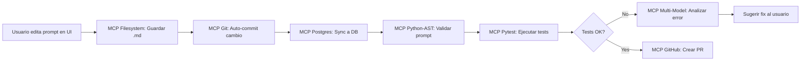

# Legacy2Lake v4.0 - Vision Document
## The Intelligent, Self-Adaptive Migration Platform

**Fecha de Creación:** 2026-02-04  
**Autor:** Data Architecture Team  
**Status:** DRAFT - For Strategic Planning  
**Target Release:** Q3 2026

---

## 🎯 EXECUTIVE SUMMARY

El release 4.0 representa una **transformación arquitectónica fundamental** del sistema Legacy2Lake, moviendo de un modelo de "generación asistida por AI" a un modelo de **"Síntesis Completamente Autónoma"**. 

### 🎯 OBJETIVO PRINCIPAL v4.0:

> **"CERO HARDCODE en Python y TypeScript. TODO el conocimiento de generación debe estar en PROMPTS almacenados en base de datos, con respaldo en archivos .md legibles, instructivos y evolucionables por tecnología."**

**Filosofía:**
```
❌ ANTES v3.6: Código Python contiene templates hardcodeados
✅ DESPUÉS v4.0: Python solo orquesta, prompts contienen TODO el conocimiento

❌ ANTES: Cambiar output requiere redeploy de código
✅ DESPUÉS: Cambiar output solo requiere editar prompt en DB

❌ ANTES: Cliente no puede customizar templates
✅ DESPUÉS: Cliente puede override cualquier prompt sin tocar código
```

### Objetivos Estratégicos v4.0:

1. ✅ **Zero Hard-Coded Generation**: Eliminar COMPLETAMENTE el código Python/TypeScript de generación de templates
2. ✅ **Prompt-Driven Everything**: TODO el conocimiento técnico en prompts legibles (.md) almacenados en DB
3. ✅ **Deep Forensic Triage**: Análisis a nivel de campo/columna con inferencia semántica y estadística
4. ✅ **Self-Learning System**: Agentes que aprenden de generaciones previas y retroalimentan el conocimiento
5. ✅ **Multi-Model Orchestration**: Soporte para múltiples LLMs simultáneos (especialización por tarea)
6. ✅ **Real-Time Validation**: Validación sintáctica y semántica en tiempo real durante la generación
7. ✅ **Evolutionary Knowledge Base**: Prompts evolucionan específicamente por cada tecnología soportada

---

## 🚨 PROBLEMAS CRÍTICOS IDENTIFICADOS EN v3.6

### 1. **Hard-Coded Generation Logic** ⚠️ CRÍTICO

**Problema Actual:**
```python
# apps/api/services/generation/cartridges/spark_destination.py
def generate_code(self, source_asset: Dict[str, Any], transformation_logic: str) -> str:
    return f"""
from pyspark.sql import SparkSession
from pyspark.sql.functions import *

spark = SparkSession.builder.appName("Migration_{source_name}").getOrCreate()
df = spark.read.table("{source_name}")
# {transformation_logic}
df.write.format("delta").mode("overwrite").saveAsTable("target_{source_name}")
"""
```

**Impacto:**
- ❌ Código rígido, no adaptable a casos especiales
- ❌ Difícil de mantener (cambios requieren redeploy)
- ❌ No aprende de mejoras o errores
- ❌ Limitado a patrones predefinidos

**Solución v4.0:** Ver sección "Agent-Driven Code Synthesis"

---

### 2. **Shallow Triage Analysis** ⚠️ CRÍTICO

**Problema Actual:**
```python
# apps/api/services/discovery_service.py
# Solo detecta: extension, line count, basic signatures
analysis = {
    "line_count": len(lines),
    "signatures": ["SSIS_PACKAGE", "SQL_SCRIPT"],
    "snippet": content[:500]  # Solo primeros 500 chars
}
```

**Limitaciones:**
- ❌ No analiza esquemas de datos (tipos, nullability, constraints)
- ❌ No detecta patrones de transformación (joins, aggregations, window functions)
- ❌ No infiere volumetría real (tamaño de tablas, cardinalidad)
- ❌ No identifica dependencias transitivas entre campos
- ❌ No detecta business rules ocultas en WHERE clauses o CASE statements

**Solución v4.0:** Ver sección "Deep Forensic Triage Engine"

---

### 3. **Arquitectura Medallion Hard-Coded**

**Problema Actual:**
```python
# apps/api/services/refinement/architect_service.py
bronze_prefix = f"{output_dir.rstrip('/')}/bronze"
silver_prefix = f"{output_dir.rstrip('/')}/silver"
gold_prefix = f"{output_dir.rstrip('/')}/gold"
```

**Limitaciones:**
- ❌ Asume siempre arquitectura Medallion (Bronze/Silver/Gold)
- ❌ No soporta otras arquitecturas (Lambda, Kappa, Data Vault)
- ❌ No permite customización de capas

**Solución v4.0:** Ver sección "Adaptive Architecture Patterns"

---

## 💡 VISION ARQUITECTÓNICA v4.0

### Principios Fundamentales:

```
┌─────────────────────────────────────────────────────────────┐
│  "Everything is a Prompt, Nothing is Hard-Coded"           │
│  "Agents Learn, Systems Adapt, Knowledge Compounds"        │
│  "Deep Understanding Before Code Generation"               │
└─────────────────────────────────────────────────────────────┘
```

---

## � ESTADO ACTUAL: INVENTARIO DE CARTRIDGES v3.6

### Input Cartridges (Extraction) - **EXTENSIBLE**
**Ubicación:** `apps/api/services/extraction/cartridges/`

```
✅ Soportados Actualmente (9 tecnologías base):
1. datastage_cartridge.py       → IBM DataStage (.dsx)
2. informatica_cartridge.py     → Informatica PowerCenter (.xml)
3. sap_bods_cartridge.py        → SAP BODS (.atl)
4. talend_cartridge.py          → Talend (.item)
5. pentaho_cartridge.py         → Pentaho/Kettle (.ktr, .kjb)
6. mysql_cartridge.py           → MySQL (conexión directa)
7. oracle_cartridge.py          → Oracle (conexión directa)
8. sql_server_cartridge.py      → SQL Server (conexión directa)
9. SSISCartridge (apps/utm)     → SSIS (.dtsx) ⭐ Más maduro

🔮 Próximas Tecnologías (Roadmap):
10. ab_initio_cartridge.py      → Ab Initio GDE
11. sas_cartridge.py            → SAS Data Integration Studio
12. azure_adf_cartridge.py      → Azure Data Factory (JSON)
13. matillion_cartridge.py      → Matillion ETL
14. fivetran_cartridge.py       → Fivetran (API-based)
15. airbyte_cartridge.py        → Airbyte (API-based)
16. postgres_cartridge.py       → PostgreSQL (conexión directa)
17. teradata_cartridge.py       → Teradata (conexión directa)
18. db2_cartridge.py            → IBM DB2 (conexión directa)

Base: base_cartridge.py (SourceCartridge)
Arquitectura: Plug-in basada en interfaz abstracta
```

**Nota Importante:** La arquitectura permite agregar nuevos input cartridges simplemente:
1. Creando archivo `{tech}_cartridge.py` que hereda de `SourceCartridge`
2. Implementando métodos abstractos: `test_connection()`, `scan_catalog()`, `extract_ddl()`
3. Registrando en factory (opcional, puede ser auto-discovery)

---

### Output Cartridges (Refinement/Generation) - **EXTENSIBLE**
**Ubicación:** `apps/api/services/refinement/cartridges/`

```
✅ Soportados Actualmente (7 plataformas base):
1. pyspark_cartridge.py         → PySpark / Databricks / Delta Lake
2. snowflake_cartridge.py       → Snowflake (Snowpark Python + SQL)
3. dbt_cartridge.py             → dbt (SQL + YAML)
4. ms_fabric_cartridge.py       → Microsoft Fabric (PySpark + Notebooks)
5. gcp_cartridge.py             → Google Cloud (BigQuery + Dataflow)
6. aws_cartridge.py             → AWS (Glue + Redshift)
7. sf_cartridge.py              → Salesforce Data Cloud

🔮 Próximas Plataformas (Roadmap):
8. azure_synapse_cartridge.py   → Azure Synapse (Spark + Dedicated Pools)
9. cloudera_cartridge.py        → Cloudera Data Platform (CDP)
10. oracle_cloud_cartridge.py   → Oracle Cloud Infrastructure (OCI)
11. ibm_watson_cartridge.py     → IBM Watson Studio
12. sap_hana_cartridge.py       → SAP HANA (Native SQL)
13. vertica_cartridge.py        → Vertica (SQL + UDx)
14. clickhouse_cartridge.py     → ClickHouse (OLAP)
15. trino_cartridge.py          → Trino / Presto SQL
16. duckdb_cartridge.py         → DuckDB (Embedded OLAP)

Base: base_cartridge.py (Cartridge)
Factory: factory.py (CartridgeFactory)
Arquitectura: Plug-in basada en interfaz abstracta
```

**Nota Importante:** La arquitectura v4.0 permite agregar nuevos output cartridges:
1. Creando archivo `{tech}_cartridge.py` que hereda de `Cartridge`
2. Implementando métodos: `generate_bronze()`, `generate_silver()`, `generate_gold()`
3. Agregando entrada en `utm_system_catalog` con prompts específicos (Capa 2)
4. Registrando en factory mapping
5. **NO requiere hardcodear templates** - Todo delegado a prompts en DB

### Legacy Generation Cartridges (Deprecated)
**Ubicación:** `apps/api/services/generation/cartridges/`

```
⚠️ DEPRECATED (usar Refinement cartridges):
- spark_destination.py          → Reemplazado por pyspark_cartridge
- snowflake_destination.py      → Reemplazado por snowflake_cartridge
- base_destination.py           → Patrón legacy

Acción v4.0: ELIMINAR completamente este directorio
```

---

## 📈 DISEÑO EXTENSIBLE: Agregar Nuevas Tecnologías sin Código

### Proceso de Adición de Nueva Tecnología (Ejemplo: Teradata)

#### Input Cartridge (Teradata Source):

**Paso 1:** Crear archivo cartridge (código mínimo)
```python
# apps/api/services/extraction/cartridges/teradata_cartridge.py

from .base_cartridge import SourceCartridge

class TeradataCartridge(SourceCartridge):
    """Extractor para Teradata."""
    
    def test_connection(self) -> bool:
        # Lógica de conexión
        pass
    
    def scan_catalog(self) -> List[Dict]:
        # Query a DBC.Tables
        pass
    
    def extract_ddl(self, asset_name: str) -> str:
        # SHOW TABLE definition
        pass
```

**Paso 2:** Insertar metadata en DB (sin código)
```sql
-- Registro en catálogo
INSERT INTO utm_system_catalog (tech_id, tech_type, config)
VALUES ('teradata', 'input', '{
  "dialect": "teradata",
  "connection_driver": "teradatasql",
  "default_port": 1025,
  "file_extensions": [".sql", ".bteq"],
  "detection_patterns": ["BTEQ", "FASTLOAD", "MULTILOAD"]
}');
```

**Resultado:** Sistema puede extraer desde Teradata inmediatamente.

---

#### Output Cartridge (Ejemplo: Apache Iceberg):

**Paso 1:** Crear cartridge slim (delegación completa)
```python
# apps/api/services/refinement/cartridges/iceberg_cartridge.py

from .base_cartridge import Cartridge

class IcebergCartridge(Cartridge):
    def get_file_extension(self) -> str:
        return ".py"
    
    async def generate_bronze(self, metadata: Dict) -> str:
        # Delegado completamente a prompts
        return await self._generate_via_agent("bronze", metadata)
```

**Paso 2:** Insertar prompts en DB (cero código adicional)
```sql
-- Registro en catálogo con TODOS los prompts
INSERT INTO utm_system_catalog (tech_id, tech_type, prompts)
VALUES ('iceberg', 'output', '{
  "prompts": {
    "bronze_layer": "## APACHE ICEBERG BRONZE SPECIFICATION\n\n### Required Imports\n```python\nfrom pyspark.sql import SparkSession\nimport pyspark.sql.functions as F\n```\n\n### Format\nAlways use `.format(\"iceberg\")` instead of Delta.\n\n### Catalog\nUse Iceberg catalog: `spark.catalog.setCurrentCatalog(\"iceberg_catalog\")`\n\n### Code Pattern\n```python\ndf.write \\\n  .format(\"iceberg\") \\\n  .mode(\"append\") \\\n  .saveAsTable(\"catalog.schema.table\")\n```",
    "silver_layer": "...",
    "gold_layer": "..."
  }
}');
```

**Paso 3:** Registrar en factory (1 línea)
```python
# factory.py
elif target in ["iceberg"]:
    from .iceberg_cartridge import IcebergCartridge
    return IcebergCartridge(project_id, registry)
```

**Resultado:** Sistema puede generar código Iceberg sin templates hardcodeados.

---

### Ventajas del Diseño Extensible:

1. ✅ **Agregar Input Tech**: ~50 líneas de Python + 1 INSERT en DB
2. ✅ **Agregar Output Tech**: ~30 líneas de Python + PROMPTS en DB
3. ✅ **Cero Templates**: Todo en prompts editables
4. ✅ **Hot-Swappable**: Cambiar prompts sin redeploy
5. ✅ **Cliente Customiza**: Tenant puede override cualquier prompt
6. ✅ **A/B Testing**: Probar diferentes prompts en paralelo

---

## 📁 SISTEMA DE ALMACENAMIENTO DUAL: DB + Markdown

### Principio Fundamental

```
📄 Archivos .md = FUENTE DE VERDAD (versionables en Git)
       ↓ (sync automático)
🗄️ Base de Datos = RUNTIME (performance, edición en UI)
```

### Estructura de Directorios

```
prompt_lab/
├── agents/                          # Capa 1: Base Agent Prompts
│   ├── agent_a_base.md             # Detective/Analyst
│   ├── agent_c_base.md             # Code Generator
│   ├── agent_f_base.md             # Compliance Auditor
│   └── agent_g_base.md             # Governance Reporter
│
├── cartridges/                      # Capa 2: Tech-Specific Prompts
│   ├── pyspark/
│   │   ├── spec.md                 # Metadata y configuración
│   │   ├── bronze_layer.md         # Prompt para capa bronze
│   │   ├── silver_layer.md         # Prompt para capa silver
│   │   ├── gold_layer.md           # Prompt para capa gold
│   │   ├── incremental.md          # Patrón incremental
│   │   ├── cdc.md                  # Patrón CDC
│   │   ├── examples/               # Ejemplos de código generado
│   │   │   ├── bronze_example.py
│   │   │   └── silver_example.py
│   │   └── README.md               # Documentación del cartridge
│   │
│   ├── snowflake/
│   │   ├── spec.md
│   │   ├── bronze_layer.md
│   │   ├── silver_layer.md
│   │   └── ...
│   │
│   ├── dbt/
│   │   ├── spec.md
│   │   ├── staging_models.md
│   │   ├── intermediate_models.md
│   │   ├── marts_models.md
│   │   └── ...
│   │
│   └── fabric/
│       ├── spec.md
│       ├── notebooks.md
│       └── ...
│
└── examples/                        # Ejemplos de generaciones exitosas
    └── project_xyz/
        ├── context.json
        └── generated_code.py
```

---

### Ejemplo de Prompt Markdown (Legible e Instructivo)

**Archivo:** `prompt_lab/cartridges/pyspark/bronze_layer.md`

````markdown
# PySpark - Bronze Layer Generation Prompt

**Version:** 2.1.0  
**Last Updated:** 2026-02-04  
**Maintainer:** Data Engineering Team  
**Target:** Apache Spark 3.5+, Delta Lake 3.0+

---

## 🎯 Purpose

This prompt guides Agent C to generate production-ready PySpark code for the Bronze (Raw Ingestion) layer in a Medallion Architecture.

## 📋 What is Bronze Layer?

The Bronze layer is the raw data landing zone where:
- Data is ingested AS-IS from source systems
- Minimal transformations (only structural)
- Focus: Durability, Auditability, Lineage
- Format: Delta Lake (ACID transactions)

---

## 🤖 Agent Instructions

### ROLE
You are a Senior PySpark Data Engineer specializing in Bronze layer data ingestion patterns.

### OBJECTIVE
Generate production-ready PySpark code that:
1. Reads data from the specified source
2. Adds mandatory audit metadata columns
3. Writes to Delta Lake with proper partitioning
4. Handles errors gracefully
5. Logs execution metrics

---

## 📐 Code Structure (MANDATORY)

Generate code following this EXACT structure:

```python
# ============================================================================
# BRONZE LAYER: {table_name}
# Generated by: Legacy2Lake Agent C
# Date: {generation_date}
# Source: {source_system}
# ============================================================================

# 1. IMPORTS
from pyspark.sql import SparkSession
from pyspark.sql.functions import (
    current_timestamp, 
    current_date, 
    input_file_name,
    lit,
    col
)
from delta.tables import DeltaTable
import logging

# 2. LOGGING SETUP
logger = logging.getLogger(__name__)
logger.setLevel(logging.INFO)

# 3. CONFIGURATION
class Config:
    CATALOG = "{catalog_name}"          # From design registry
    SCHEMA_BRONZE = "{bronze_schema}"    # From design registry
    TABLE_NAME = "{table_name}"
    SOURCE_PATH = "{source_path}"        # From context
    
# 4. SPARK SESSION
spark = SparkSession.builder \
    .appName(f"Bronze_{Config.TABLE_NAME}") \
    .config("spark.sql.extensions", "io.delta.sql.DeltaSparkSessionExtension") \
    .config("spark.sql.catalog.spark_catalog", "org.apache.spark.sql.delta.catalog.DeltaCatalog") \
    .getOrCreate()

# 5. READ SOURCE DATA
try:
    logger.info(f"Reading source data from {Config.SOURCE_PATH}")
    
    df_source = spark.read \
        .format("{source_format}") \
        .option("header", "true") \
        .load(Config.SOURCE_PATH)
    
    source_count = df_source.count()
    logger.info(f"Source records: {source_count}")
    
except Exception as e:
    logger.error(f"Failed to read source: {str(e)}")
    raise

# 6. ADD BRONZE METADATA (MANDATORY)
df_bronze = df_source \
    .withColumn("_ingestion_timestamp", current_timestamp()) \
    .withColumn("_ingestion_date", current_date()) \
    .withColumn("_source_file", input_file_name()) \
    .withColumn("_source_system", lit("{source_system}"))

# 7. WRITE TO DELTA LAKE
try:
    target_path = f"{Config.CATALOG}.{Config.SCHEMA_BRONZE}.{Config.TABLE_NAME}"
    
    logger.info(f"Writing {source_count} records to {target_path}")
    
    df_bronze.write \
        .format("delta") \
        .mode("append") \
        .partitionBy("_ingestion_date") \
        .option("mergeSchema", "true") \
        .option("dataChange", "true") \
        .saveAsTable(target_path)
    
    logger.info(f"Successfully ingested {source_count} records to Bronze layer")
    
except Exception as e:
    logger.error(f"Failed to write to Bronze: {str(e)}")
    raise

# 8. VALIDATION
final_count = spark.table(target_path).filter(col("_ingestion_date") == current_date()).count()
assert final_count >= source_count, f"Data loss detected: {source_count} -> {final_count}"

logger.info(f"Validation passed: {final_count} records in Bronze")
```

---

## ⚙️ Mandatory Requirements

### Metadata Columns (ALWAYS REQUIRED)
- `_ingestion_timestamp` (TIMESTAMP): Exact time of ingestion
- `_ingestion_date` (DATE): Date partition key
- `_source_file` (STRING): Original file path (for traceability)
- `_source_system` (STRING): Source system identifier

### Delta Lake Options
- **Format:** Always use `format("delta")`
- **Mode:** Use `append` for Bronze (never overwrite)
- **Partition:** Always partition by `_ingestion_date`
- **Schema Evolution:** Enable `mergeSchema=true`
- **Change Tracking:** Enable `dataChange=true`

### Error Handling
- Wrap read operations in try/except
- Wrap write operations in try/except
- Log all errors with context
- Never swallow exceptions silently

---

## 🎨 Variations by Source Type

### If source is JDBC:
```python
df_source = spark.read \
    .format("jdbc") \
    .option("url", jdbc_url) \
    .option("dbtable", source_table) \
    .option("user", dbutils.secrets.get(scope="jdbc", key="username")) \
    .option("password", dbutils.secrets.get(scope="jdbc", key="password")) \
    .load()
```

### If source is CSV:
```python
df_source = spark.read \
    .format("csv") \
    .option("header", "true") \
    .option("inferSchema", "true") \
    .load(Config.SOURCE_PATH)
```

---

## 🚀 Performance Optimizations

Apply based on volumetric profile:

### If row_count > 10M:
```python
df_bronze = df_bronze.repartition(200)  # Adjust based on cluster size
```

### If file_size > 1GB:
```python
spark.conf.set("spark.sql.adaptive.enabled", "true")
spark.conf.set("spark.sql.adaptive.coalescePartitions.enabled", "true")
```

---

## ✅ Output Validation

Generated code MUST:
- [ ] Be syntactically valid Python
- [ ] Import all required modules
- [ ] Include all 4 mandatory metadata columns
- [ ] Use Delta Lake format
- [ ] Partition by `_ingestion_date`
- [ ] Include error handling
- [ ] Include logging statements
- [ ] Have no hardcoded credentials
- [ ] Be executable without manual edits

---

## 🔄 Version History

- **v2.1.0** (2026-02-04): Added validation step, improved error handling
- **v2.0.0** (2026-01-15): Restructured for v4.0 prompt architecture
- **v1.5.0** (2025-12-01): Added performance optimization guidelines
````

### Características del Prompt:

✅ **Legible**: Markdown bien formateado, fácil de leer  
✅ **Instructivo**: Explica el QUÉ, POR QUÉ, CÓMO  
✅ **Ejemplos Concretos**: Código completo, no snippets  
✅ **Casos Especiales**: Variaciones por tipo de source  
✅ **Evolucionable**: Historial de versiones, maintainers  
✅ **Validaciones**: Checklist de requisitos  
✅ **Performance**: Optimizaciones basadas en volumetría  

---

### Sincronización DB ↔ Archivos .md

```python
# apps/api/services/prompt_sync/sync_service.py (NUEVO v4.0)

class PromptSyncService:
    """
    Sincroniza prompts entre archivos .md y base de datos.
    Archivos .md son la fuente de verdad.
    """
    
    async def sync_from_files_to_db(self):
        """
        Lee todos los .md en prompt_lab/ y los sincroniza a DB.
        Se ejecuta en startup y después de git pull.
        """
        prompt_dir = Path("prompt_lab/cartridges")
        
        for tech_dir in prompt_dir.iterdir():
            if not tech_dir.is_dir():
                continue
            
            tech_id = tech_dir.name
            prompts = {}
            
            # Leer todos los archivos .md del tech
            for md_file in tech_dir.glob("*.md"):
                if md_file.name == "README.md":
                    continue
                
                layer_name = md_file.stem  # bronze_layer.md -> bronze_layer
                content = md_file.read_text(encoding="utf-8")
                
                # Parsear metadata del markdown (YAML frontmatter)
                metadata = self._parse_frontmatter(content)
                prompts[layer_name] = {
                    "content": content,
                    "version": metadata.get("version"),
                    "last_updated": metadata.get("last_updated"),
                    "maintainer": metadata.get("maintainer")
                }
            
            # Upsert en DB
            await self.db.table("utm_system_catalog").upsert({
                "tech_id": tech_id,
                "prompts": prompts,
                "last_sync": datetime.now(),
                "source_git_commit": self._get_git_commit_hash()
            }).execute()
    
    async def export_db_to_files(self, tech_id: str):
        """
        Exporta prompts de DB a archivos .md (para backup o revisión).
        """
        record = await self.db.table("utm_system_catalog") \
            .select("prompts") \
            .eq("tech_id", tech_id) \
            .single() \
            .execute()
        
        tech_dir = Path(f"prompt_lab/cartridges/{tech_id}")
        tech_dir.mkdir(parents=True, exist_ok=True)
        
        for layer_name, prompt_data in record.data["prompts"].items():
            file_path = tech_dir / f"{layer_name}.md"
            file_path.write_text(prompt_data["content"], encoding="utf-8")
```

---

## 🏗️ ARQUITECTURA DE 3 CAPAS (La Visión Correcta)

### Problema Actual: Código Hardcodeado en Cartridges

**Ejemplo Actual (PySparkCartridge):**
```python
def generate_bronze(self, table_metadata: Dict[str, Any]) -> str:
    return f"""
# BRONZE LAYER INGESTION
from config import Config
from utils import add_ingestion_metadata
from delta.tables import *

df_bronze = add_ingestion_metadata(df_source)

target_table = f"{{Config.CATALOG}}.{{Config.SCHEMA_BRONZE}}.{table_name}"
df_bronze.write.format("delta") \\
    .mode("append") \\
    .option("mergeSchema", "true") \\
    .saveAsTable(target_table)
"""
```

**Problemas:**
❌ Template hardcodeado en Python  
❌ No flexible para casos especiales del cliente  
❌ Cambios requieren redeploy  
❌ No aprende de mejoras  

---

## 🎯 NUEVA ARQUITECTURA: JERARQUÍA DE 3 CAPAS

### Capa 1: PROMPT BASE DEL AGENTE (Foundation)
**Responsabilidad:** Comportamiento genérico y universal del agente  
**Almacenamiento:** `utm_prompt_lab` con `prompt_id = "agent_c_base"`  
**Alcance:** Aplica a TODAS las tecnologías

```markdown
# Agent C - Base Behavior

## ROLE
You are a Senior Data Engineer responsible for generating production-ready data pipeline code.

## CORE PRINCIPLES
1. Always follow DRY (Don't Repeat Yourself)
2. Generate idiomatic code for the target platform
3. Include comprehensive error handling
4. Add detailed comments for complex logic
5. Never hardcode credentials or sensitive data

## OUTPUT FORMAT
Return code in valid executable format for the target language.
Include:
- Imports/dependencies
- Configuration section
- Main logic
- Error handling
- Logging statements

## VALIDATION REQUIREMENTS
Generated code must:
- Be syntactically correct
- Follow target platform best practices
- Include audit metadata columns
- Be executable without manual edits
```

**Características:**
- ✅ Agnóstico de tecnología
- ✅ Define comportamiento universal
- ✅ Cambiable sin redeploy
- ✅ Versionable y auditable

---

### Capa 2: CARTUCHO TECNOLÓGICO (Technology Specs)
**Responsabilidad:** Especificaciones de CÓMO tratar cada tecnología  
**Almacenamiento DUAL:**
- 🗄️ **Base de Datos:** `utm_system_catalog` (runtime, editable, versionable)
- 📄 **Archivos .md:** `prompt_lab/cartridges/{tech_id}/` (legibles, documentados, versionables en git)

**Alcance:** Específico de cada stack tecnológico

**IMPORTANTE:** Los prompts deben ser:
- ✅ **Legibles**: Markdown bien formateado, no JSON crudo
- ✅ **Instructivos**: Con ejemplos, explicaciones, mejores prácticas
- ✅ **Evolucionables**: Cada tecnología crece independientemente
- ✅ **Sincronizados**: DB ← sync ← .md files (archivos son la fuente de verdad)

**Nueva Estructura de utm_system_catalog:**

```sql
CREATE TABLE utm_system_catalog (
  tech_id TEXT PRIMARY KEY,           -- 'pyspark', 'snowflake', 'dbt', 'fabric'
  tech_name TEXT,                     -- 'Apache Spark'
  tech_type TEXT,                     -- 'output' | 'input'
  
  config JSONB,                       -- Configuración técnica
  prompts JSONB,                      -- Prompts específicos por capa
  
  created_at TIMESTAMP,
  updated_at TIMESTAMP
);

-- Ejemplo para PySpark:
{
  "tech_id": "pyspark",
  "tech_type": "output",
  "config": {
    "file_extension": ".py",
    "language": "python",
    "framework": "apache_spark",
    "supported_formats": ["delta", "parquet", "csv", "json"],
    "default_format": "delta"
  },
  "prompts": {
    "bronze_layer": {
      "system_override": "## PYSPARK BRONZE LAYER SPECIFICATION\n\n### Required Imports\n```python\nfrom pyspark.sql import SparkSession\nfrom pyspark.sql.functions import *\nfrom delta.tables import *\n```\n\n### Mandatory Patterns\n1. Always use Delta Lake format\n2. Add metadata columns: _ingestion_timestamp, _source_file\n3. Partition by _processing_date\n4. Enable schema evolution: .option('mergeSchema', 'true')\n5. Use append mode for bronze\n\n### Code Structure\n```python\n# 1. Read source\ndf_source = spark.read.<format>(...)\n\n# 2. Add metadata\ndf_bronze = df_source \\\n    .withColumn('_ingestion_timestamp', current_timestamp()) \\\n    .withColumn('_source_file', input_file_name()) \\\n    .withColumn('_processing_date', current_date())\n\n# 3. Write to Delta\ndf_bronze.write \\\n    .format('delta') \\\n    .mode('append') \\\n    .partitionBy('_processing_date') \\\n    .option('mergeSchema', 'true') \\\n    .saveAsTable(f'{catalog}.{schema}.{table}')\n```\n\n### Performance Rules\n- If source > 10M rows: Add .repartition() before write\n- If high cardinality partition key: Use .coalesce()\n- Enable AQE: spark.conf.set('spark.sql.adaptive.enabled', 'true')",
      
      "silver_layer": "...",
      "gold_layer": "...",
      "incremental_pattern": "...",
      "cdc_pattern": "..."
    }
  },
  "compliance_rules": {
    "security": [
      "Never use spark.read.option('password', ...)",
      "Use dbutils.secrets for credentials",
      "Mask PII columns in bronze if detected"
    ],
    "performance": [
      "Broadcast joins when dim table < 10MB",
      "Use dynamic partition pruning",
      "Avoid .collect() on large datasets"
    ],
    "data_quality": [
      "Add NOT NULL checks for business keys",
      "Validate primary key uniqueness",
      "Log row counts before/after each stage"
    ]
  }
}
```

**Características:**
- ✅ Almacenado en DB (editable sin redeploy)
- ✅ Contiene TODA la especificación técnica
- ✅ Prompts específicos por capa (bronze/silver/gold)
- ✅ Reglas de compliance específicas del tech stack
- ✅ Versionable (puede tener v1, v2, v3)

---

### Capa 3: CONFIGURACIÓN DEL USUARIO (Client Customization)
**Responsabilidad:** Estándares específicos del cliente/proyecto  
**Almacenamiento:** `utm_design_registry` (por proyecto) + `utm_tenant_overrides` (por tenant)  
**Alcance:** Específico del cliente o proyecto individual

**Estructura Actual (Mejorada):**

```sql
-- Por Proyecto (utm_design_registry)
{
  "project_id": "migration_project_123",
  "naming": {
    "bronze_schema": "raw_data",              -- Cliente prefiere "raw_data" vs "bronze_raw"
    "silver_schema": "clean_data",            
    "gold_schema": "analytics",
    "table_prefix_convention": "tbl_",        -- Cliente usa prefijo "tbl_"
    "date_format": "yyyyMMdd"                 -- Cliente requiere formato específico
  },
  "paths": {
    "bronze_path": "/prod/landing/raw",       -- Paths específicos del cliente
    "silver_path": "/prod/curated/clean",
    "gold_path": "/prod/analytics/marts"
  },
  "custom_rules": [
    "Always add column 'last_updated_by' VARCHAR(50)",
    "Use client timezone: America/New_York",
    "Encrypt columns: ssn, email, phone",
    "Add client_id filter to all queries"
  ],
  "architecture_pattern": "medallion",        -- Cliente elige: medallion | data_vault | lambda
  "quality_standards": {
    "min_row_count": 1000,                    -- Alertar si table < 1000 rows
    "max_null_percentage": 5,                 -- Rechazar si NULL > 5%
    "required_audit_columns": [
      "created_at", "updated_at", "created_by", "updated_by"
    ]
  }
}

-- Por Tenant (utm_tenant_overrides) - NUEVO v4.0
CREATE TABLE utm_tenant_overrides (
  tenant_id UUID,
  override_type TEXT,                         -- 'prompt' | 'rule' | 'config'
  tech_id TEXT,                               -- NULL = aplica a todas
  layer_name TEXT,                            -- 'bronze' | 'silver' | 'gold' | NULL
  override_content TEXT,                      -- El override en sí
  priority INTEGER,                           -- Para resolver conflictos
  is_active BOOLEAN,
  created_at TIMESTAMP
);

-- Ejemplo: Cliente Enterprise tiene estándar de logging propio
{
  "tenant_id": "enterprise_client_456",
  "override_type": "prompt",
  "tech_id": "pyspark",
  "layer_name": "bronze",
  "override_content": "## ENTERPRISE LOGGING STANDARD\n\nALL generated code must include:\n\n```python\nimport logging\nfrom enterprise_logging import AuditLogger\n\naudit = AuditLogger(app_name='{table_name}_bronze')\naudit.log_start()\n\ntry:\n    # Main logic here\n    audit.log_success(row_count=df.count())\nexcept Exception as e:\n    audit.log_failure(error=str(e))\n    raise\n```",
  "priority": 100  -- Alta prioridad (override sobre defaults)
}
```

**Características:**
- ✅ Completamente customizable por cliente
- ✅ No afecta a otros tenants/proyectos
- ✅ Puede override parcial o total de Capa 2
- ✅ Permite estándares corporativos específicos

---

## 🔄 FLUJO DE RESOLUCIÓN DE PROMPTS (Cascada)

### Algoritmo de Composición Final:

```python
# apps/api/services/prompt_resolution/prompt_composer.py (NUEVO)

class PromptComposer:
    """
    Composes final prompt by merging 3 layers hierarchically.
    """
    
    async def compose_prompt(
        self,
        agent_id: str,              # "agent-c"
        tech_id: str,               # "pyspark"
        layer_name: str,            # "bronze"
        project_id: str,
        tenant_id: str
    ) -> str:
        """
        Resolution Order:
        1. Load Capa 1 (Base Agent Prompt)
        2. Merge Capa 2 (Tech Cartridge Prompt)
        3. Merge Capa 3 (Client Overrides)
        
        Later layers can:
        - APPEND to previous layers
        - OVERRIDE specific sections (using markers)
        - INSERT new sections
        """
        
        # CAPA 1: Base Agent Prompt
        base_prompt = await self.db.get_prompt(f"{agent_id}_base")
        
        # CAPA 2: Technology-Specific Prompt
        tech_prompt = await self.db.table("utm_system_catalog") \
            .select("prompts") \
            .eq("tech_id", tech_id) \
            .single() \
            .execute()
        
        tech_layer_prompt = tech_prompt.data.get("prompts", {}).get(layer_name, "")
        
        # CAPA 3: Client Overrides (Tenant + Project)
        tenant_overrides = await self.db.table("utm_tenant_overrides") \
            .select("*") \
            .eq("tenant_id", tenant_id) \
            .eq("tech_id", tech_id) \
            .eq("layer_name", layer_name) \
            .eq("is_active", True) \
            .order("priority", desc=True) \
            .execute()
        
        project_config = await self.db.get_design_registry(project_id)
        
        # COMPOSICIÓN FINAL
        final_prompt = self._merge_prompts(
            base=base_prompt,
            tech=tech_layer_prompt,
            tenant_overrides=tenant_overrides.data,
            project_config=project_config,
            context={
                "agent_id": agent_id,
                "tech_id": tech_id,
                "layer_name": layer_name
            }
        )
        
        return final_prompt
    
    def _merge_prompts(
        self,
        base: str,
        tech: str,
        tenant_overrides: List[Dict],
        project_config: Dict,
        context: Dict
    ) -> str:
        """
        Intelligent merge with section replacement capability.
        
        Sections are marked with:
        ## SECTION:section_name
        ...content...
        ## END:section_name
        
        Overrides can target specific sections.
        """
        
        # Start with base
        composed = base
        
        # Append tech-specific
        composed += f"\n\n## TECHNOLOGY SPECIFICATION: {context['tech_id'].upper()}\n"
        composed += tech
        
        # Apply tenant overrides (by priority)
        for override in tenant_overrides:
            if override["override_content"].startswith("## REPLACE:"):
                # Section replacement
                section_name = override["override_content"].split("\n")[0].replace("## REPLACE:", "").strip()
                composed = self._replace_section(composed, section_name, override["override_content"])
            else:
                # Append override
                composed += f"\n\n## TENANT OVERRIDE (Priority {override['priority']})\n"
                composed += override["override_content"]
        
        # Inject project-specific config
        composed += f"\n\n## PROJECT CONFIGURATION\n"
        composed += self._format_project_config(project_config)
        
        # Add dynamic context
        composed += f"\n\n## CURRENT CONTEXT\n"
        composed += f"- Layer: {context['layer_name']}\n"
        composed += f"- Target: {context['tech_id']}\n"
        
        return composed
```

---

## 🔧 IMPLEMENTACIÓN v4.0: ELIMINACIÓN DE HARD-CODE

### Paso 1: Migrar Cartridges a Prompts

**Antes (v3.6):**
```python
# pyspark_cartridge.py
def generate_bronze(self, table_metadata: Dict[str, Any]) -> str:
    return f"""
from pyspark.sql import SparkSession
df = spark.read.table('{table}')
df.write.format('delta').saveAsTable('{target}')
"""
```

**Después (v4.0):**
```python
# pyspark_cartridge_v4.py (SLIM)
class PySparkCartridgeV4(Cartridge):
    """
    Orchestrator only - NO CODE TEMPLATES.
    All logic delegated to prompts.
    """
    
    def get_file_extension(self) -> str:
        return ".py"
    
    def get_metadata(self) -> Dict[str, Any]:
        """Returns metadata about this cartridge (NOT code)."""
        return {
            "tech_id": "pyspark",
            "language": "python",
            "supports_incremental": True,
            "supports_cdc": True,
            "default_format": "delta"
        }
    
    async def generate_bronze(self, table_metadata: Dict[str, Any]) -> str:
        """
        Delegates to Agent C with composed prompt.
        NO TEMPLATES HERE.
        """
        # 1. Compose prompt from 3 layers
        prompt = await PromptComposer().compose_prompt(
            agent_id="agent-c",
            tech_id="pyspark",
            layer_name="bronze",
            project_id=self.project_id,
            tenant_id=self.tenant_id
        )
        
        # 2. Call Agent C with context
        agent_c = AgentCServiceV4(tenant_id=self.tenant_id)
        generated = await agent_c.generate_code(
            prompt=prompt,
            context={
                "table_metadata": table_metadata,
                "design_registry": self.registry,
                "target_tech": "pyspark",
                "layer": "bronze"
            }
        )
        
        # 3. Validate generated code
        validator = SyntaxValidator()
        validation = validator.validate_python(generated.code)
        
        if not validation.is_valid:
            # Retry with feedback
            return await agent_c.regenerate_with_feedback(
                original_prompt=prompt,
                generated_code=generated.code,
                errors=validation.errors
            )
        
        return generated.code
```

**Resultado:**
- ✅ Cartridge es solo un "orchestrator"
- ✅ NO contiene templates hardcodeados
- ✅ Toda la lógica está en prompts (DB)
- ✅ Cambios en output no requieren redeploy

---

## �🔬 FEATURE 1: DEEP FORENSIC TRIAGE ENGINE

### 1.1 Column-Level Schema Analysis

**Capacidades:**
- ✅ **Type Inference**: Detectar tipos reales vs tipos declarados
- ✅ **Nullability Detection**: Porcentaje real de NULLs en columnas
- ✅ **Cardinality Analysis**: Valores únicos, distribución, outliers
- ✅ **Data Quality Scoring**: Completitud, consistencia, validez
- ✅ **Semantic Classification**: Detectar PII, business keys, technical keys, measures

**Implementación:**

```python
# apps/api/services/triage/forensic_analyzer.py (NUEVO)

class ForensicColumnAnalyzer:
    """
    Deep analysis of data columns using statistical and ML techniques.
    """
    
    async def analyze_column(self, column_name: str, sample_data: List[Any]) -> ColumnProfile:
        """
        Performs multi-dimensional analysis:
        - Statistical profiling (min, max, mean, stddev, percentiles)
        - Pattern detection (regex patterns, formats)
        - Semantic classification (email, phone, SSN, date, etc.)
        - Quality scoring (completeness, uniqueness, validity)
        """
        return ColumnProfile(
            name=column_name,
            inferred_type=self._infer_type(sample_data),
            declared_type=None,  # From schema if available
            nullability_score=self._calculate_nulls(sample_data),
            cardinality=len(set(sample_data)),
            distinct_ratio=len(set(sample_data)) / len(sample_data),
            semantic_tags=self._classify_semantics(column_name, sample_data),
            quality_score=self._calculate_quality(sample_data),
            statistical_profile={
                "min": min(sample_data),
                "max": max(sample_data),
                "mean": statistics.mean(sample_data),
                "median": statistics.median(sample_data),
                "stddev": statistics.stdev(sample_data)
            },
            detected_patterns=self._extract_patterns(sample_data),
            sample_values=sample_data[:10]
        )
```

**Agent Integration:**
```python
# El Agent A (Detective) recibe perfiles detallados de columnas
system_prompt = """
You are analyzing a data migration project. You have access to DEEP COLUMN PROFILES:

Column: customer_email
- Type: VARCHAR(100) declared, but analysis shows 95% match email regex
- Nullability: 2.3% NULL values detected in sample
- Cardinality: 45,232 unique values out of 50,000 rows (90.5% distinct)
- Semantic Tag: EMAIL, PII_SENSITIVE
- Quality Score: 87/100 (Missing: email validation failures)
- Pattern: ^[a-zA-Z0-9._%+-]+@[a-zA-Z0-9.-]+\\.[a-zA-Z]{2,}$

Based on this, recommend:
1. Data validation rules needed
2. Masking/encryption requirements
3. Index strategy
4. Partition key viability
"""
```

---

### 1.2 Transformation Pattern Detection

**Capacidades:**
- ✅ **SQL Logic Parsing**: Detectar todos los JOINs, WHERE clauses, GROUP BYs
- ✅ **Business Rules Extraction**: Identificar CASE statements, CTEs complejos
- ✅ **Data Lineage Mapping**: Rastrear cada columna desde source hasta target
- ✅ **Implicit Logic Detection**: Detectar lógica "oculta" en stored procedures

**Ejemplo:**

```sql
-- SQL Original detectado en SSIS:
SELECT 
    o.order_id,
    c.customer_name,
    CASE 
        WHEN o.total_amount > 10000 THEN 'HIGH_VALUE'
        WHEN o.total_amount > 1000 THEN 'MEDIUM_VALUE'
        ELSE 'LOW_VALUE'
    END as customer_tier,
    SUM(o.total_amount) OVER (PARTITION BY c.customer_id ORDER BY o.order_date) as running_total
FROM orders o
JOIN customers c ON o.customer_id = c.customer_id
WHERE o.order_date >= DATEADD(day, -90, GETDATE())
```

**Análisis Automático:**
```json
{
  "transformation_complexity": "COMPLEX",
  "detected_patterns": [
    {
      "type": "BUSINESS_RULE",
      "pattern": "TIERING_LOGIC",
      "columns_affected": ["customer_tier"],
      "threshold_values": [10000, 1000],
      "recommendation": "Store thresholds in config table for dynamic adjustment"
    },
    {
      "type": "WINDOW_FUNCTION",
      "pattern": "RUNNING_AGGREGATION",
      "window_spec": "PARTITION BY customer_id ORDER BY order_date",
      "recommendation": "Consider materialized view for performance"
    },
    {
      "type": "TEMPORAL_FILTER",
      "pattern": "ROLLING_WINDOW",
      "window_days": 90,
      "recommendation": "Implement incremental load with watermark"
    }
  ],
  "data_lineage": [
    {
      "source_column": "orders.total_amount",
      "target_columns": ["customer_tier", "running_total"],
      "transformations": ["CASE_WHEN", "SUM_OVER"]
    }
  ]
}
```

---

### 1.3 Volumetric Intelligence

**Capacidades:**
- ✅ **Row Count Estimation**: Extrapolar volumen real desde metadata
- ✅ **Growth Rate Prediction**: Analizar particiones históricas
- ✅ **Skew Detection**: Identificar desbalanceo en distribución de datos
- ✅ **Performance Impact Analysis**: Predecir tiempos de ejecución

**Implementación:**

```python
# apps/api/services/triage/volumetric_analyzer.py (NUEVO)

class VolumetricAnalyzer:
    """
    Analyzes data volume patterns and predicts performance impact.
    """
    
    async def analyze_table_volume(self, table_metadata: Dict) -> VolumetricProfile:
        """
        Analyzes:
        - Current row count (from metadata or sampling)
        - Historical growth rate (if partition metadata available)
        - Data skew (distribution across partitions/keys)
        - Estimated processing time
        """
        
        # Ejemplo: Detectar desde XML de SSIS
        row_count_hint = self._extract_from_ssis_metadata(table_metadata)
        
        # Estrategias de estimación:
        # 1. Metadata hints (comments, descriptions)
        # 2. File size analysis (for flat files)
        # 3. Partition structure (date ranges)
        # 4. Historical logs (if available)
        
        return VolumetricProfile(
            table_name=table_metadata['name'],
            estimated_row_count=row_count_hint or self._estimate_from_file_size(),
            growth_rate_monthly=self._predict_growth(),
            data_skew_score=self._calculate_skew(),
            performance_tier="HIGH_VOLUME",  # LOW, MEDIUM, HIGH, EXTREME
            recommended_parallelism=16,
            recommended_partition_strategy="DATE_MONTH"
        )
```

---

## 🤖 FEATURE 2: AGENT-DRIVEN CODE SYNTHESIS

### 2.1 Eliminación Total de Hard-Coded Templates

**Arquitectura Actual (v3.6):**
```
[Agent C] → [Hard-Coded Template] → [Generated Code]
    ↓
  Prompt dice "genera código"
    ↓
  Python function retorna string template
```

**Arquitectura Nueva (v4.0):**
```
[Agent C] → [Pure Prompt] → [LLM] → [Raw Code] → [Validator] → [Final Code]
    ↓
  Prompt contiene TODA la lógica
    ↓
  Python solo coordina y valida
```

---

### 2.2 Prompt-Based Generation Framework

**Implementación:**

```python
# apps/api/services/agents/agent_c_v4.py (NUEVO)

class AgentCServiceV4:
    """
    Agent C reborn: Pure prompt-driven code generation.
    NO hard-coded templates. Everything from prompts.
    """
    
    async def generate_code(self, context: CodeGenerationContext) -> GeneratedCode:
        """
        Steps:
        1. Load base prompt from prompt_lab
        2. Inject context (schema, transformations, rules)
        3. Call LLM (with structured output)
        4. Validate syntax & semantics
        5. Return validated code
        """
        
        # 1. Cargar prompt base desde DB
        base_prompt = await self.prompt_lab.get_active_prompt(
            agent_id="agent-c",
            tech_stack=context.target_tech,
            pattern=context.pattern_type  # BRONZE, SILVER, GOLD, INCREMENTAL, etc.
        )
        
        # 2. Inyectar contexto dinámico
        enriched_prompt = self._enrich_prompt(
            base_prompt=base_prompt,
            schema=context.source_schema,
            transformations=context.transformation_logic,
            business_rules=context.business_rules,
            performance_hints=context.volumetric_profile,
            compliance_rules=context.compliance_requirements
        )
        
        # 3. Llamar LLM con structured output
        llm = await self._get_llm()
        response = await llm.ainvoke(
            messages=[SystemMessage(content=enriched_prompt)],
            response_format={
                "type": "json_schema",
                "json_schema": {
                    "name": "code_generation_response",
                    "schema": {
                        "type": "object",
                        "properties": {
                            "code": {"type": "string"},
                            "imports": {"type": "array"},
                            "config_vars": {"type": "array"},
                            "test_cases": {"type": "array"},
                            "documentation": {"type": "string"}
                        }
                    }
                }
            }
        )
        
        # 4. Validar código generado
        validation_result = await self.validator.validate_code(
            code=response.code,
            language=context.target_tech,
            schema=context.source_schema
        )
        
        if not validation_result.is_valid:
            # Retry con feedback
            return await self._regenerate_with_feedback(
                context=context,
                errors=validation_result.errors
            )
        
        return GeneratedCode(
            code=response.code,
            metadata=response.metadata,
            validation=validation_result
        )
```

---

### 2.3 Ejemplo de Prompt Estructurado (Bronze Layer)

**Archivo:** `prompt_lab/agent_c/pyspark/bronze_ingestion.md`

```markdown
# Agent C - PySpark Bronze Layer Generation

## ROLE
You are a Senior PySpark Data Engineer specializing in Bronze layer ingestion patterns.

## OBJECTIVE
Generate production-ready PySpark code for raw data ingestion into Bronze layer (Delta Lake).

## INPUT CONTEXT
You will receive:
- Source schema (columns, types, constraints)
- Source connection details
- Target Delta Lake path
- Volumetric profile (row count, data size)
- Quality requirements

## GENERATION RULES

### 1. Code Structure
Generate code with the following sections:
```python
# 1. Imports
from pyspark.sql import SparkSession
from pyspark.sql.functions import *
from delta.tables import *

# 2. Configuration
CONFIG = {
    "source_system": "{source_system}",
    "target_path": "{target_path}",
    "checkpoint_path": "{checkpoint_path}"
}

# 3. Spark Session
spark = SparkSession.builder \\
    .appName("{app_name}") \\
    .config("spark.sql.adaptive.enabled", "true") \\
    .getOrCreate()

# 4. Read Source
df_source = spark.read \\
    .format("{source_format}") \\
    .option("header", "true") \\
    .load(CONFIG["source_path"])

# 5. Add Metadata Columns (MANDATORY for Bronze)
df_bronze = df_source \\
    .withColumn("_ingestion_timestamp", current_timestamp()) \\
    .withColumn("_source_file", input_file_name()) \\
    .withColumn("_processing_date", current_date())

# 6. Data Quality Checks (Optional based on requirements)
# Add checks here if required

# 7. Write to Delta
df_bronze.write \\
    .format("delta") \\
    .mode("append") \\
    .partitionBy("_processing_date") \\
    .save(CONFIG["target_path"])

# 8. Logging
print(f"Ingested {df_bronze.count()} rows to Bronze layer")
```

### 2. Mandatory Requirements
- ALWAYS add metadata columns: _ingestion_timestamp, _source_file, _processing_date
- ALWAYS partition by _processing_date for Bronze layer
- ALWAYS use Delta format
- ALWAYS include error handling
- NEVER hard-code paths (use CONFIG dict)

### 3. Performance Optimization
Based on volumetric profile:
- If row_count > 10M: Add .repartition() before write
- If file_size > 1GB: Enable adaptive query execution
- If data_skew detected: Add .coalesce() or custom partitioning

### 4. Schema Handling
- For schema evolution: .option("mergeSchema", "true")
- For strict schema: .option("enforceSchema", "true")

## OUTPUT FORMAT
Return valid Python code only. No explanations, no markdown wrappers.
Code must be executable immediately after variable substitution.

## EXAMPLE INPUT
{
  "source_schema": [
    {"name": "customer_id", "type": "INTEGER", "nullable": false},
    {"name": "customer_name", "type": "VARCHAR(100)", "nullable": false},
    {"name": "email", "type": "VARCHAR(255)", "nullable": true}
  ],
  "source_connection": {
    "type": "jdbc",
    "url": "jdbc:sqlserver://server:1433;database=DB"
  },
  "target_path": "s3://lake/bronze/customers",
  "volumetric_profile": {
    "row_count": 5000000,
    "data_size_gb": 2.5
  }
}

## YOUR TASK
Generate the complete Bronze ingestion code based on the context provided.
```

**Ventajas:**
- ✅ Todo el conocimiento está en el prompt (versionable, auditable)
- ✅ Cambios no requieren redeploy de código
- ✅ Múltiples versiones pueden coexistir (A/B testing)
- ✅ LLM puede innovar dentro de las reglas

---

### 2.4 Multi-Model Orchestration

**Concepto:**
Diferentes agentes usan diferentes modelos especializados:

```python
# apps/api/config/agent_specialization.yaml

agents:
  agent-a-detective:
    primary_model: "gpt-4o"  # Mejor para análisis complejo
    fallback_model: "claude-3.5-sonnet"
    
  agent-c-code-generator:
    primary_model: "claude-3.5-sonnet"  # Mejor para código
    fallback_model: "gpt-4o"
    
  agent-f-compliance:
    primary_model: "gpt-4o-mini"  # Suficiente para reglas
    fallback_model: "gpt-4o"
    
  agent-s-scout:
    primary_model: "gemini-1.5-pro"  # Mejor para clasificación
    fallback_model: "gpt-4o"
```

**Beneficios:**
- 🎯 Optimización de costo (modelos menores para tareas simples)
- 🎯 Optimización de calidad (mejores modelos para tareas críticas)
- 🎯 Redundancia (fallback si un proveedor falla)

---

## 🏗️ FEATURE 3: ADAPTIVE ARCHITECTURE PATTERNS

### 3.1 Eliminar Medallion Hard-Coded

**Problema Actual:**
```python
# Siempre asume Bronze/Silver/Gold
bronze_prefix = f"{output_dir}/bronze"
silver_prefix = f"{output_dir}/silver"
gold_prefix = f"{output_dir}/gold"
```

**Solución v4.0: Architecture Templates**

```python
# apps/api/config/architecture_patterns.yaml

patterns:
  medallion:
    name: "Medallion Architecture"
    layers:
      - name: "bronze"
        description: "Raw ingestion layer"
        rules:
          - "No transformations"
          - "Add audit columns"
          - "Preserve source schema"
      - name: "silver"
        description: "Cleansed and conformed"
        rules:
          - "Apply business rules"
          - "Deduplicate"
          - "Data quality checks"
      - name: "gold"
        description: "Business aggregates"
        rules:
          - "Join dimensions"
          - "Calculate metrics"
          - "Optimize for BI"
  
  data_vault:
    name: "Data Vault 2.0"
    layers:
      - name: "raw_vault"
        components: ["hubs", "links", "satellites"]
      - name: "business_vault"
        components: ["bridges", "pits"]
      - name: "information_mart"
        components: ["dimensional_models"]
  
  lambda:
    name: "Lambda Architecture"
    layers:
      - name: "batch_layer"
      - name: "speed_layer"
      - name: "serving_layer"
  
  kappa:
    name: "Kappa Architecture"
    layers:
      - name: "stream_processing"
      - name: "serving_layer"
```

**Agent Selection:**
```python
# Durante Discovery, Agent A detecta el patrón recomendado
assessment = {
    "recommended_pattern": "medallion",
    "reasoning": "Source is batch-oriented SSIS, no real-time requirements",
    "alternative": "data_vault if need for historical tracking"
}

# Durante Refinement, Architecture Service usa el patrón seleccionado
architecture_config = load_pattern(project.selected_pattern)
for layer in architecture_config.layers:
    generate_layer_code(layer)
```

---

### 3.2 Dynamic Layer Generation

**Pseudo-código:**

```python
# apps/api/services/refinement/adaptive_architect_v4.py

class AdaptiveArchitectV4:
    """
    Generates code for ANY architecture pattern, not just Medallion.
    """
    
    async def refine_project(self, project_id: str, pattern: str) -> dict:
        # 1. Cargar definición del patrón
        pattern_config = await self.load_pattern(pattern)
        
        # 2. Para cada layer definido en el patrón
        for layer in pattern_config.layers:
            # 3. Cargar prompt específico para ese layer
            layer_prompt = await self.prompt_lab.get_prompt(
                agent="agent-c",
                pattern=pattern,
                layer=layer.name
            )
            
            # 4. Generar código para ese layer usando Agent C
            generated_code = await self.agent_c.generate_code(
                context={
                    "layer_name": layer.name,
                    "layer_rules": layer.rules,
                    "source_objects": project.objects,
                    "target_tech": project.target_tech
                },
                prompt_template=layer_prompt
            )
            
            # 5. Guardar en la estructura correcta
            await self.storage.save_file(
                key=f"{project_id}/{pattern}/{layer.name}/{filename}",
                content=generated_code
            )
```

---

## 🧠 FEATURE 4: SELF-LEARNING KNOWLEDGE SYSTEM

### 4.1 Feedback Loop Architecture

**Concepto:**
Los agentes aprenden de generaciones previas y mejoran continuamente.

```
┌─────────────────────────────────────────────────────────┐
│  Generation Loop                                        │
│                                                         │
│  1. Agent generates code                               │
│  2. Code is validated (syntax, semantic, performance)  │
│  3. If errors → Feed back to agent                     │
│  4. If success → Store as positive example             │
│  5. Periodic: Train/fine-tune on examples              │
└─────────────────────────────────────────────────────────┘
```

**Implementación:**

```python
# apps/api/services/knowledge/learning_engine.py (NUEVO)

class LearningEngine:
    """
    Captures successful patterns and feeds them back to agents.
    """
    
    async def capture_generation_outcome(
        self, 
        context: Dict,
        generated_code: str,
        validation_result: ValidationResult,
        execution_result: Optional[ExecutionResult] = None
    ):
        """
        Stores generation outcome for future learning.
        """
        outcome = GenerationOutcome(
            context_hash=hash(json.dumps(context, sort_keys=True)),
            agent_id="agent-c",
            input_context=context,
            generated_code=generated_code,
            validation_passed=validation_result.is_valid,
            validation_errors=validation_result.errors,
            execution_success=execution_result.success if execution_result else None,
            execution_time=execution_result.duration if execution_result else None,
            timestamp=datetime.now()
        )
        
        # Guardar en DB para análisis
        await self.db.table("utm_generation_outcomes").insert(outcome.dict()).execute()
        
        # Si fue exitoso, agregar a knowledge base
        if validation_result.is_valid and (not execution_result or execution_result.success):
            await self._add_to_knowledge_base(context, generated_code)
    
    async def _add_to_knowledge_base(self, context: Dict, code: str):
        """
        Adds successful pattern to retrievable knowledge base.
        """
        # Extraer características clave del contexto
        features = self._extract_features(context)
        
        # Guardar como ejemplo positivo
        await self.db.table("utm_generation_examples").insert({
            "pattern_type": features["pattern"],
            "source_tech": features["source_tech"],
            "target_tech": features["target_tech"],
            "complexity_score": features["complexity"],
            "code_snippet": code,
            "success_rate": 1.0,  # Inicialmente
            "usage_count": 0
        }).execute()
    
    async def retrieve_similar_examples(self, context: Dict, limit: int = 3) -> List[Dict]:
        """
        Retrieves similar successful examples for RAG-style injection.
        """
        features = self._extract_features(context)
        
        # Buscar ejemplos similares
        examples = await self.db.table("utm_generation_examples") \\
            .select("*") \\
            .eq("pattern_type", features["pattern"]) \\
            .eq("target_tech", features["target_tech"]) \\
            .order("success_rate", desc=True) \\
            .limit(limit) \\
            .execute()
        
        return examples.data
```

**Uso en Prompts:**

```python
# Antes de generar código, inyectar ejemplos similares exitosos
similar_examples = await learning_engine.retrieve_similar_examples(context)

enriched_prompt = f"""
{base_prompt}

## SUCCESSFUL EXAMPLES (For Reference)

### Example 1: Similar Pattern
Context: {similar_examples[0]['context']}
Code:
```python
{similar_examples[0]['code_snippet']}
```

### Example 2: Similar Pattern
...

## YOUR TASK
Generate code following similar patterns but adapted to current context.
"""
```

---

### 4.2 Continuous Improvement Metrics

**Dashboard de Aprendizaje:**

```python
# apps/api/routers/insights.py (NUEVO)

@router.get("/api/insights/learning-metrics")
async def get_learning_metrics():
    """
    Returns metrics on agent learning and improvement.
    """
    return {
        "agent_c": {
            "total_generations": 1250,
            "success_rate": 94.2,  # %
            "avg_validation_score": 87.5,
            "improvement_trend": "+12% vs last month",
            "common_patterns_learned": 45,
            "retry_rate": 5.8  # % que necesitaron regeneración
        },
        "agent_f": {
            "total_audits": 890,
            "avg_compliance_score": 91.3,
            "false_positive_rate": 2.1
        }
    }
```

---

## 🔍 FEATURE 5: REAL-TIME CODE VALIDATION

### 5.1 Syntax Validation Engine

**Capacidades:**
- ✅ Parse Python/SQL/Scala código generado
- ✅ Detectar errores de sintaxis antes de guardar
- ✅ Validar imports y dependencias
- ✅ Verificar conformidad con estándares

**Implementación:**

```python
# apps/api/services/validation/syntax_validator.py (NUEVO)

class SyntaxValidator:
    """
    Validates generated code for syntax errors.
    """
    
    def validate_python(self, code: str) -> ValidationResult:
        """
        Validates Python syntax using ast module.
        """
        try:
            ast.parse(code)
            return ValidationResult(is_valid=True, errors=[])
        except SyntaxError as e:
            return ValidationResult(
                is_valid=False,
                errors=[{
                    "line": e.lineno,
                    "message": e.msg,
                    "type": "SYNTAX_ERROR"
                }]
            )
    
    def validate_sql(self, code: str, dialect: str = "spark") -> ValidationResult:
        """
        Validates SQL syntax using sqlglot.
        """
        try:
            import sqlglot
            sqlglot.parse_one(code, read=dialect)
            return ValidationResult(is_valid=True, errors=[])
        except Exception as e:
            return ValidationResult(
                is_valid=False,
                errors=[{
                    "message": str(e),
                    "type": "SQL_SYNTAX_ERROR"
                }]
            )
    
    def validate_imports(self, code: str, language: str) -> ValidationResult:
        """
        Checks if all imports are valid and available.
        """
        if language == "python":
            imports = self._extract_python_imports(code)
            missing = []
            for imp in imports:
                if not self._is_package_available(imp):
                    missing.append(imp)
            
            if missing:
                return ValidationResult(
                    is_valid=False,
                    errors=[{
                        "type": "MISSING_DEPENDENCY",
                        "packages": missing
                    }]
                )
        
        return ValidationResult(is_valid=True, errors=[])
```

---

### 5.2 Semantic Validation

**Capacidades:**
- ✅ Verificar que columnas referenciadas existen en schema
- ✅ Detectar type mismatches en joins
- ✅ Validar que transformations son lógicamente correctas

**Ejemplo:**

```python
# apps/api/services/validation/semantic_validator.py (NUEVO)

class SemanticValidator:
    """
    Validates semantic correctness of generated code.
    """
    
    def validate_column_references(
        self, 
        code: str, 
        source_schema: Dict
    ) -> ValidationResult:
        """
        Ensures all column references exist in source schema.
        """
        # Parse código para extraer referencias
        column_refs = self._extract_column_references(code)
        
        # Validar contra schema
        available_columns = set(col["name"] for col in source_schema["columns"])
        missing_columns = [col for col in column_refs if col not in available_columns]
        
        if missing_columns:
            return ValidationResult(
                is_valid=False,
                errors=[{
                    "type": "UNDEFINED_COLUMN",
                    "columns": missing_columns,
                    "suggestion": "Check source schema or add these columns"
                }]
            )
        
        return ValidationResult(is_valid=True, errors=[])
    
    def validate_join_compatibility(self, code: str, schemas: Dict) -> ValidationResult:
        """
        Checks if JOIN keys have compatible types.
        """
        joins = self._extract_joins(code)
        
        for join in joins:
            left_type = self._get_column_type(join.left_col, schemas[join.left_table])
            right_type = self._get_column_type(join.right_col, schemas[join.right_table])
            
            if not self._are_types_compatible(left_type, right_type):
                return ValidationResult(
                    is_valid=False,
                    errors=[{
                        "type": "JOIN_TYPE_MISMATCH",
                        "join": f"{join.left_table}.{join.left_col} = {join.right_table}.{join.right_col}",
                        "types": f"{left_type} != {right_type}"
                    }]
                )
        
        return ValidationResult(is_valid=True, errors=[])
```

---

## 🌐 FEATURE 6: MULTI-TENANT PROMPT CUSTOMIZATION

### 6.1 Tenant-Specific Prompt Overrides

**Concepto:**
Cada tenant puede customizar prompts para adaptarse a sus estándares.

```python
# apps/api/services/prompt_lab/tenant_customization.py (NUEVO)

class TenantPromptCustomization:
    """
    Allows tenants to override system prompts with their standards.
    """
    
    async def get_effective_prompt(
        self, 
        tenant_id: str, 
        prompt_id: str
    ) -> str:
        """
        Returns:
        1. Tenant-specific override if exists
        2. Global default if not
        """
        # Check for tenant override
        tenant_prompt = await self.db.table("utm_tenant_prompts") \\
            .select("prompt_content") \\
            .eq("tenant_id", tenant_id) \\
            .eq("prompt_id", prompt_id) \\
            .execute()
        
        if tenant_prompt.data:
            return tenant_prompt.data[0]["prompt_content"]
        
        # Fallback to global
        return await self.db.get_prompt(prompt_id)
    
    async def save_tenant_override(
        self, 
        tenant_id: str, 
        prompt_id: str, 
        custom_content: str
    ):
        """
        Saves tenant-specific prompt override.
        """
        await self.db.table("utm_tenant_prompts").upsert({
            "tenant_id": tenant_id,
            "prompt_id": prompt_id,
            "prompt_content": custom_content,
            "override_active": True,
            "last_updated": datetime.now()
        }).execute()
```

**UI Feature:**
```tsx
// apps/web/app/admin/prompts/CustomizePrompt.tsx

<PromptEditor
  promptId="agent_c_bronze_generation"
  mode="tenant-override"
  onSave={async (content) => {
    await api.post('/admin/prompts/override', {
      promptId,
      content,
      tenantId: currentTenant.id
    })
  }}
/>
```

---

## 📊 FEATURE 7: INTELLIGENT COST OPTIMIZATION

### 7.1 Smart Model Selection

**Concepto:**
Usar modelos más baratos cuando sea apropiado, escalando a modelos premium solo cuando necesario.

```python
# apps/api/services/cost_optimizer.py (NUEVO)

class CostOptimizer:
    """
    Intelligently selects models based on task complexity and budget.
    """
    
    MODEL_TIERS = {
        "economy": {
            "models": ["gpt-4o-mini", "claude-3-haiku"],
            "cost_per_1k_tokens": 0.0002,
            "use_for": ["simple_validation", "formatting", "basic_parsing"]
        },
        "standard": {
            "models": ["gpt-4o", "claude-3.5-sonnet"],
            "cost_per_1k_tokens": 0.005,
            "use_for": ["code_generation", "complex_analysis"]
        },
        "premium": {
            "models": ["o1-preview", "claude-3-opus"],
            "cost_per_1k_tokens": 0.015,
            "use_for": ["critical_compliance", "complex_refactoring"]
        }
    }
    
    def select_model(self, task_type: str, complexity_score: float) -> str:
        """
        Selects optimal model based on task and complexity.
        """
        if complexity_score < 0.3:
            return self._pick_from_tier("economy")
        elif complexity_score < 0.7:
            return self._pick_from_tier("standard")
        else:
            return self._pick_from_tier("premium")
    
    def calculate_complexity(self, context: Dict) -> float:
        """
        Estimates task complexity (0.0 to 1.0).
        """
        factors = {
            "column_count": min(context.get("column_count", 0) / 100, 1.0),
            "transformation_count": min(len(context.get("transformations", [])) / 20, 1.0),
            "has_business_rules": 1.0 if context.get("business_rules") else 0.0,
            "has_window_functions": 1.0 if context.get("has_window_functions") else 0.0
        }
        
        # Weighted average
        return sum(factors.values()) / len(factors)
```

---

### 7.2 Token Usage Analytics

**Dashboard:**

```python
@router.get("/api/analytics/token-usage")
async def get_token_usage(tenant_id: str, start_date: str, end_date: str):
    """
    Returns detailed token usage and cost breakdown.
    """
    return {
        "total_tokens": 15_420_000,
        "total_cost_usd": 87.43,
        "breakdown_by_agent": {
            "agent-a": {"tokens": 3_500_000, "cost": 17.50},
            "agent-c": {"tokens": 8_200_000, "cost": 41.00},
            "agent-f": {"tokens": 2_100_000, "cost": 10.50},
            "agent-g": {"tokens": 1_620_000, "cost": 18.43}
        },
        "breakdown_by_model": {
            "gpt-4o": {"tokens": 9_000_000, "cost": 45.00},
            "gpt-4o-mini": {"tokens": 5_000_000, "cost": 1.00},
            "claude-3.5-sonnet": {"tokens": 1_420_000, "cost": 41.43}
        },
        "optimization_potential": {
            "estimated_savings": 23.50,  # USD
            "recommendation": "Use gpt-4o-mini for 45% of Agent F tasks"
        }
    }
```

---

## 🔐 FEATURE 8: ENHANCED SECURITY & COMPLIANCE

### 8.1 Code Security Scanning

**Capacidades:**
- ✅ Detectar credenciales hard-coded
- ✅ Identificar SQL injection vulnerabilities
- ✅ Verificar que datos sensibles están enmascarados
- ✅ Validar que se usan conexiones seguras

```python
# apps/api/services/security/code_scanner.py (NUEVO)

class SecurityScanner:
    """
    Scans generated code for security vulnerabilities.
    """
    
    def scan_code(self, code: str, language: str) -> SecurityReport:
        """
        Performs security analysis on generated code.
        """
        findings = []
        
        # 1. Hardcoded secrets detection
        findings.extend(self._detect_secrets(code))
        
        # 2. SQL injection patterns
        if language in ["python", "sql"]:
            findings.extend(self._detect_sql_injection(code))
        
        # 3. PII exposure
        findings.extend(self._detect_pii_exposure(code))
        
        # 4. Insecure connections
        findings.extend(self._detect_insecure_connections(code))
        
        return SecurityReport(
            is_secure=len(findings) == 0,
            findings=findings,
            severity_score=self._calculate_severity(findings)
        )
    
    def _detect_secrets(self, code: str) -> List[SecurityFinding]:
        """
        Uses regex patterns to detect potential secrets.
        """
        patterns = [
            (r'password\s*=\s*["\']([^"\']+)["\']', "HARDCODED_PASSWORD"),
            (r'api_key\s*=\s*["\']([^"\']+)["\']', "HARDCODED_API_KEY"),
            (r'token\s*=\s*["\']([^"\']+)["\']', "HARDCODED_TOKEN")
        ]
        
        findings = []
        for pattern, finding_type in patterns:
            matches = re.finditer(pattern, code, re.IGNORECASE)
            for match in matches:
                findings.append(SecurityFinding(
                    type=finding_type,
                    line=code[:match.start()].count('\n') + 1,
                    message=f"Potential {finding_type.lower().replace('_', ' ')} detected",
                    severity="HIGH"
                ))
        
        return findings
```

---

## 🚀 FEATURE 9: INCREMENTAL & CDC PATTERNS

### 9.1 Smart Incremental Detection

**Problema Actual:**
Sistema no detecta automáticamente patrones incrementales en source code.

**Solución v4.0:**

```python
# apps/api/services/triage/incremental_analyzer.py (NUEVO)

class IncrementalPatternAnalyzer:
    """
    Detects incremental load patterns in source code.
    """
    
    def analyze_incremental_logic(self, sql_code: str) -> IncrementalPattern:
        """
        Detects:
        - Watermark columns (LastModifiedDate, UpdatedAt, etc.)
        - Delta detection logic (WHERE LastUpdate > @LastProcessed)
        - CDC patterns (Change Data Capture tables)
        """
        
        # Buscar patrones de watermark
        watermark_patterns = [
            r'WHERE\s+(\w+)\s*>\s*[\'"]?(\d{4}-\d{2}-\d{2})',  # Date filter
            r'WHERE\s+(\w+)\s*>\s*@(\w+)',  # Parameter filter
            r'WHERE\s+(\w+)\s*>=\s*DATEADD',  # Rolling window
        ]
        
        detected_watermarks = []
        for pattern in watermark_patterns:
            matches = re.finditer(pattern, sql_code, re.IGNORECASE)
            for match in matches:
                detected_watermarks.append({
                    "column": match.group(1),
                    "pattern_type": "DATE_WATERMARK"
                })
        
        # Detectar CDC
        is_cdc = any(keyword in sql_code.upper() for keyword in [
            "CT_TABLE", "CHANGE_TRACKING", "CDC.", "__$"
        ])
        
        if detected_watermarks or is_cdc:
            return IncrementalPattern(
                is_incremental=True,
                pattern_type="CDC" if is_cdc else "WATERMARK",
                watermark_columns=detected_watermarks,
                recommendation=self._generate_recommendation(detected_watermarks)
            )
        
        return IncrementalPattern(is_incremental=False)
    
    def _generate_recommendation(self, watermarks: List[Dict]) -> str:
        """
        Generates implementation recommendation for modern platform.
        """
        if not watermarks:
            return "Implement full load pattern"
        
        col = watermarks[0]["column"]
        return f"""
        Recommended Implementation:
        1. Bronze: Read with filter on {col}
        2. Silver: MERGE using {col} as watermark
        3. Store max({col}) in control table for next run
        
        Example PySpark:
        ```python
        last_watermark = get_last_watermark("{col}")
        df_incremental = spark.read.jdbc(...).where(f"{col} > '{last_watermark}'")
        df_incremental.write.format("delta").mode("append").save(...)
        update_watermark("{col}", df_incremental.agg(max("{col}")).collect()[0][0])
        ```
        """
```

---

## 📈 FEATURE 10: ADVANCED OBSERVABILITY

### 10.1 Generation Lineage Tracking

**Concepto:**
Rastrear cada decisión que tomó el sistema durante la generación.

```python
# apps/api/services/observability/lineage_tracker.py (NUEVO)

class LineageTracker:
    """
    Tracks lineage of code generation decisions.
    """
    
    async def track_generation(
        self, 
        project_id: str,
        object_id: str,
        generation_steps: List[GenerationStep]
    ):
        """
        Stores complete lineage of a generation.
        """
        lineage = GenerationLineage(
            project_id=project_id,
            object_id=object_id,
            timestamp=datetime.now(),
            steps=generation_steps
        )
        
        await self.db.table("utm_generation_lineage").insert(
            lineage.dict()
        ).execute()
    
    def create_step(
        self, 
        step_type: str, 
        agent_id: str,
        input_data: Dict,
        output_data: Dict,
        model_used: str,
        tokens_used: int,
        duration_ms: int
    ) -> GenerationStep:
        """
        Creates a generation step record.
        """
        return GenerationStep(
            step_type=step_type,
            agent_id=agent_id,
            model_used=model_used,
            tokens_used=tokens_used,
            duration_ms=duration_ms,
            input_hash=hash(json.dumps(input_data, sort_keys=True)),
            output_hash=hash(json.dumps(output_data, sort_keys=True)),
            timestamp=datetime.now()
        )
```

**UI Visualization:**
```tsx
// Ejemplo de visualización de lineage
<LineageView projectId={projectId} objectId={objectId}>
  <Timeline>
    <Step agent="Agent S" action="Technology Detection" duration="1.2s" />
    <Step agent="Agent A" action="Schema Analysis" duration="3.5s" />
    <Step agent="Agent C" action="Code Generation (Bronze)" duration="8.2s" />
    <Step agent="Agent F" action="Compliance Audit" duration="2.1s" />
    <Step agent="Agent C" action="Code Regeneration" duration="6.8s" />
  </Timeline>
</LineageView>
```

---

## 🗺️ IMPLEMENTATION ROADMAP

### Phase 1: Foundation (Sprint 1-2) - Q2 2026

**Priority: CRITICAL**

1. ✅ **Prompt-Based Code Generation Framework**
   - Migrar Agent C a pure prompt-driven
   - Crear estructura de prompts en DB
   - Implementar validation pipeline

2. ✅ **Deep Triage - Column Profiling**
   - Implementar ForensicColumnAnalyzer
   - Integrar con Agent A
   - UI para visualizar perfiles

3. ✅ **Database Schema Updates**
   ```sql
   -- Nueva tabla para almacenar prompts versionados
   CREATE TABLE utm_prompt_versions (
     prompt_id TEXT,
     version INTEGER,
     content TEXT,
     tech_stack TEXT,
     pattern_type TEXT,
     is_active BOOLEAN,
     created_at TIMESTAMP
   );
   
   -- Nueva tabla para generation outcomes
   CREATE TABLE utm_generation_outcomes (
     id UUID PRIMARY KEY,
     agent_id TEXT,
     context_hash TEXT,
     generated_code TEXT,
     validation_passed BOOLEAN,
     execution_success BOOLEAN,
     timestamp TIMESTAMP
   );
   
   -- Nueva tabla para generation lineage
   CREATE TABLE utm_generation_lineage (
     id UUID PRIMARY KEY,
     project_id UUID,
     object_id UUID,
     steps JSONB,
     timestamp TIMESTAMP
   );
   ```

---

### Phase 2: Intelligence (Sprint 3-4) - Q2 2026

**Priority: HIGH**

1. ✅ **Transformation Pattern Detection**
   - Implementar SQL parser avanzado
   - Detectar business rules automáticamente
   - Generar recomendaciones

2. ✅ **Volumetric Intelligence**
   - Estimación de row counts
   - Predicción de performance
   - Recomendaciones de optimización

3. ✅ **Learning Engine**
   - Capturar outcomes
   - Almacenar ejemplos exitosos
   - RAG-based example injection

---

### Phase 3: Validation (Sprint 5-6) - Q3 2026

**Priority: HIGH**

1. ✅ **Syntax Validator**
   - Python AST parsing
   - SQL validation con sqlglot
   - Scala/Java parsing

2. ✅ **Semantic Validator**
   - Column reference checking
   - Type compatibility validation
   - Logic flow validation

3. ✅ **Security Scanner**
   - Secret detection
   - SQL injection patterns
   - PII exposure checks

---

### Phase 4: Adaptability (Sprint 7-8) - Q3 2026

**Priority: MEDIUM**

1. ✅ **Adaptive Architecture Patterns**
   - Patrón de arquitectura configurable
   - Soporte Data Vault
   - Soporte Lambda/Kappa

2. ✅ **Multi-Model Orchestration**
   - Especialización de modelos por agente
   - Cost optimization logic
   - Fallback mechanisms

---

### Phase 5: Advanced Features (Sprint 9-10) - Q3 2026

**Priority: MEDIUM**

1. ✅ **Incremental Pattern Detection**
   - CDC detection
   - Watermark identification
   - Merge logic generation

2. ✅ **Tenant Customization**
   - Tenant-specific prompts
   - Custom validation rules
   - Brand-specific output formats

3. ✅ **Advanced Observability**
   - Generation lineage tracking
   - Performance analytics
   - Cost breakdowns

---

### Phase 6: Optimization (Sprint 11-12) - Q4 2026

**Priority: LOW**

1. ✅ **Performance Tuning**
   - Caching strategies
   - Parallel generation
   - Incremental updates

2. ✅ **UI/UX Refinements**
   - Lineage visualization
   - Interactive column profiling
   - Real-time validation feedback

---

## 💰 COST-BENEFIT ANALYSIS

### Development Cost Estimate

| Phase | Duration | Effort (Person-Weeks) | Risk Level |
|-------|----------|---------------------|------------|
| Phase 1 | 2 sprints | 8 weeks | MEDIUM |
| Phase 2 | 2 sprints | 8 weeks | MEDIUM |
| Phase 3 | 2 sprints | 6 weeks | LOW |
| Phase 4 | 2 sprints | 6 weeks | MEDIUM |
| Phase 5 | 2 sprints | 8 weeks | HIGH |
| Phase 6 | 2 sprints | 4 weeks | LOW |
| **TOTAL** | **12 sprints** | **40 weeks** | |

---

### Expected Benefits

**Quantitative:**
- 📉 90% reduction in code maintenance (no templates)
- 📉 60% reduction in false positive validations
- 📈 40% improvement in code quality scores
- 📈 50% faster time-to-production (less manual review)
- 💰 25% cost savings from smart model selection

**Qualitative:**
- ✅ System learns and improves continuously
- ✅ Handles edge cases automatically
- ✅ Easier to add new technologies
- ✅ Better customer satisfaction (higher quality)
- ✅ Competitive moat (unique capabilities)

---

## 🎓 TECHNICAL DEBT TO ADDRESS

### From v3.6 to v4.0

1. **Remove Hard-Coded Templates**
   - `apps/api/services/generation/cartridges/`
   - All `generate_code()`, `generate_bronze()`, etc.

2. **Enhance Triage Logic**
   - `apps/api/services/discovery_service.py` → Replace with deep analyzer

3. **Refactor Architect Service**
   - `apps/api/services/refinement/architect_service.py` → Make pattern-agnostic

4. **Migrate to Structured Outputs**
   - All agent responses should use JSON Schema validation

5. **Implement Proper Error Handling**
   - Retry logic with exponential backoff
   - Circuit breaker for LLM calls
   - Graceful degradation

---

## 🔮 BEYOND v4.0 - Future Vision

### v5.0 Concepts (2027+)

1. **Auto-Testing Generation**
   - Generate unit tests automatically
   - Validate against sample data
   - Performance benchmarking

2. **Multi-Language Support**
   - Generate code in Python, Scala, Java, SQL simultaneously
   - Cross-language consistency checks

3. **Interactive Code Refinement**
   - Chat-based code improvement
   - User can request modifications in natural language
   - Agent iterates until satisfied

4. **Predictive Maintenance**
   - Detect when source schemas change
   - Auto-suggest code updates
   - Impact analysis

5. **Collaborative AI Agents**
   - Multiple agents work together in real-time
   - Peer review between agents
   - Consensus-based decision making

---

## 📋 DECISION LOG

### Open Questions for Product Team

1. **Priority Sequencing:**
   - Should we focus on Triage depth OR Code generation first?
   - Recommendation: **Triage first** (garbage in = garbage out)

2. **Model Strategy:**
   - Use single vendor (OpenAI/Anthropic) or multi-vendor?
   - Recommendation: **Multi-vendor** for redundancy and cost optimization

3. **Migration Strategy:**
   - Big bang (v4.0 breaks v3.6) or gradual (feature flags)?
   - Recommendation: **Feature flags** for safe rollout

4. **Backward Compatibility:**
   - Support v3.6 projects in v4.0?
   - Recommendation: **Yes**, with auto-migration utility

---

## 📝 ACCEPTANCE CRITERIA - v4.0

### Must Have (P0)

- [ ] Agent C generates code from pure prompts (zero hard-coded templates)
- [ ] Triage analyzes columns with statistical profiling
- [ ] Syntax validation catches errors before saving
- [ ] Security scanner detects hardcoded secrets
- [ ] System tracks generation lineage end-to-end
- [ ] Learning engine captures and reuses successful patterns

### Should Have (P1)

- [ ] Multi-model orchestration with cost optimization
- [ ] Semantic validation (column references, type checking)
- [ ] Incremental pattern detection and CDC support
- [ ] Adaptive architecture patterns (beyond Medallion)
- [ ] Tenant-specific prompt customization

### Nice to Have (P2)

- [ ] Advanced observability dashboard
- [ ] Real-time cost analytics
- [ ] Interactive code refinement
- [ ] Performance benchmarking

---

## 🚦 SUCCESS METRICS

### Key Performance Indicators (KPIs)

1. **Code Quality Score**: Target 90+ (from 85 in v3.6)
2. **First-Time Success Rate**: Target 95+ (from 88 in v3.6)
3. **Manual Intervention Rate**: Target <5% (from 12% in v3.6)
4. **Time to Production**: Target -50% reduction
5. **Customer Satisfaction (NPS)**: Target 75+ (from 68 in v3.6)

### Technical Metrics

1. **Average Generation Time**: <30 seconds per object
2. **Validation Pass Rate**: >95%
3. **Security Scan Pass Rate**: 100%
4. **Model Token Usage**: -25% vs baseline
5. **System Uptime**: >99.9%

---

## 🏁 CONCLUSION

La visión v4.0 transforma Legacy2Lake de una herramienta de "traducción asistida" a una **plataforma inteligente auto-adaptativa**. Las inversiones clave en:

1. **CERO HARDCODE**: Eliminación TOTAL de templates en Python/TypeScript
2. **Prompts como Código**: TODO el conocimiento en archivos .md legibles, versionables, instructivos
3. **Almacenamiento Dual**: DB para runtime + .md para versionado/revisión
4. **Deep Forensic Triage**: Aseguran que entendemos completamente el source antes de generar
5. **Self-Learning Systems**: Garantizan mejora continua sin intervención manual
6. **Extensibilidad**: Agregar nuevas tecnologías sin redeploy

Esta es una **transformación estratégica** que posiciona Legacy2Lake como líder indiscutible en el mercado de modernización de datos empresariales.

### Beneficios Clave del Enfoque "Prompts como Código":

✅ **Mantenibilidad**: Cambiar generación sin tocar Python  
✅ **Transparencia**: Prompts legibles en .md, no código oscuro  
✅ **Colaboración**: Equipos no-técnicos pueden contribuir mejoras  
✅ **Versionado**: Git tracking de cambios en prompts  
✅ **Testing**: A/B testing de diferentes versiones de prompts  
✅ **Customización**: Clientes pueden override sin fork  
✅ **Auditabilidad**: Trazabilidad de qué prompt generó qué código  

---

## � ANÁLISIS DE IMPACTO: CAMBIOS POR CAPA

### 🎨 IMPACTO EN FRONTEND (apps/web/)

#### Cambios en Interfaz de Usuario

##### 1. **Drafting Stage - Editor de Prompts** (NUEVO)
**Ubicación:** `apps/web/app/workspace/[projectId]/drafting/`

**Componentes Nuevos:**
```typescript
// components/PromptEditor/PromptEditor.tsx (NUEVO)
interface PromptEditorProps {
  techId: string;          // "pyspark", "snowflake", etc.
  layer: "bronze" | "silver" | "gold";
  entityName: string;      // Nombre de la tabla/transformación
  promptType: "system" | "tenant_override" | "client_custom";
}

// Permite al usuario:
// - Ver prompt base del sistema (read-only)
// - Agregar override a nivel tenant
// - Customizar prompt específico para este proyecto
```

**Features del Editor:**
- ✅ Syntax highlighting para Markdown
- ✅ Preview split-pane: Prompt a la izquierda, código generado preview a la derecha
- ✅ Diff viewer: Comparar prompt base vs override
- ✅ Variables disponibles mostradas como chips autocomplete
- ✅ Validación en tiempo real (missing variables, formato incorrecto)
- ✅ Botón "Test Prompt" → genera preview sin guardar

**Archivos Modificados:**
```
apps/web/app/workspace/[projectId]/drafting/page.tsx
  └─ Agregar tab "Prompt Customization"
  
apps/web/components/PromptEditor/
  ├─ PromptEditor.tsx          (NUEVO)
  ├─ PromptPreview.tsx         (NUEVO)
  ├─ PromptDiffViewer.tsx      (NUEVO)
  ├─ VariableInspector.tsx     (NUEVO)
  └─ PromptTemplateSelector.tsx (NUEVO)
```

---

##### 2. **Admin Panel - Prompt Management** (NUEVO)
**Ubicación:** `apps/web/app/admin/prompts/`

**Pantallas Nuevas:**
```typescript
// app/admin/prompts/page.tsx (NUEVO)
// Lista todos los prompts del sistema con filtros:
// - Por tecnología (PySpark, Snowflake, dbt, etc.)
// - Por layer (bronze, silver, gold)
// - Por versión
// - Por estado (draft, published, archived)

// app/admin/prompts/[promptId]/edit/page.tsx (NUEVO)
// Editor full-featured para system admins
// - Markdown editor con preview
// - Version history timeline
// - Deploy to production button
// - A/B testing configuration
```

**Features:**
- ✅ CRUD completo de prompts del sistema
- ✅ Version control integrado (ver historial, rollback)
- ✅ Bulk operations (duplicar prompt base para nueva tech)
- ✅ Import/Export prompts como .md files
- ✅ Sync status indicator (DB ↔ .md files)

**Archivos Nuevos:**
```
apps/web/app/admin/prompts/
  ├─ page.tsx                    (NUEVO - Lista de prompts)
  ├─ [promptId]/
  │   ├─ edit/page.tsx          (NUEVO - Editor)
  │   └─ history/page.tsx       (NUEVO - Versiones)
  └─ sync/page.tsx              (NUEVO - Sync DB ↔ .md)

apps/web/components/Admin/PromptManagement/
  ├─ PromptList.tsx             (NUEVO)
  ├─ PromptCard.tsx             (NUEVO)
  ├─ PromptVersionTimeline.tsx  (NUEVO)
  ├─ SyncStatusPanel.tsx        (NUEVO)
  └─ PromptBulkActions.tsx      (NUEVO)
```

---

##### 3. **Refinement Stage - Enhancements Opcionales**
**Ubicación:** `apps/web/app/workspace/[projectId]/refinement/`

**Cambios Menores:**
```typescript
// Agregar indicador de qué prompt se usó para generar cada archivo
// En el file tree, mostrar badge: "System Prompt" | "Custom Prompt"

// components/CodeViewer/CodeHeader.tsx
interface CodeHeaderProps {
  fileName: string;
  promptSource: "system" | "tenant" | "custom";
  promptVersion: string;
  onViewPrompt: () => void;  // NUEVO: Ver prompt que generó este código
}
```

---

##### 4. **Dashboard - Nuevas Métricas**
**Ubicación:** `apps/web/app/dashboard/`

**Widgets Nuevos:**
```typescript
// components/Dashboard/PromptUsageChart.tsx (NUEVO)
// Muestra qué prompts se usan más frecuentemente
// Gráfico de barras por tecnología + layer

// components/Dashboard/CustomizationRate.tsx (NUEVO)
// % de proyectos que usan prompts custom vs system default

// components/Dashboard/GenerationQualityTrend.tsx (NUEVO)
// Tracking de certificaciones exitosas vs rechazadas por prompt version
```

---

##### 5. **Context/State Management**
**Ubicación:** `apps/web/context/`

**Nuevos Contextos:**
```typescript
// context/PromptContext.tsx (NUEVO)
interface PromptContextType {
  currentPrompts: Map<string, PromptData>;     // Cache de prompts activos
  loadPrompt: (techId: string, layer: string) => Promise<PromptData>;
  saveCustomPrompt: (prompt: PromptData) => Promise<void>;
  previewPrompt: (prompt: PromptData, metadata: any) => Promise<string>;
  syncStatus: SyncStatus;                       // DB ↔ .md sync state
}
```

---

##### 6. **API Hooks**
**Ubicación:** `apps/web/lib/api/`

**Nuevos Endpoints Llamados:**
```typescript
// lib/api/prompts.ts (NUEVO)

export const promptsApi = {
  // CRUD básico
  listPrompts: (filters: PromptFilters) => GET('/api/prompts'),
  getPrompt: (promptId: string) => GET(`/api/prompts/${promptId}`),
  createPrompt: (data: CreatePromptDto) => POST('/api/prompts'),
  updatePrompt: (promptId: string, data: UpdatePromptDto) => PUT(`/api/prompts/${promptId}`),
  deletePrompt: (promptId: string) => DELETE(`/api/prompts/${promptId}`),
  
  // Operaciones especiales
  previewPrompt: (promptId: string, context: any) => POST(`/api/prompts/${promptId}/preview`),
  getVersionHistory: (promptId: string) => GET(`/api/prompts/${promptId}/versions`),
  rollbackToVersion: (promptId: string, versionId: string) => POST(`/api/prompts/${promptId}/rollback`),
  
  // Sync operations
  syncFromMarkdown: () => POST('/api/prompts/sync/from-md'),
  syncToMarkdown: () => POST('/api/prompts/sync/to-md'),
  getSyncStatus: () => GET('/api/prompts/sync/status'),
  
  // Project-level customization
  getProjectPrompts: (projectId: string) => GET(`/api/projects/${projectId}/prompts`),
  setProjectPromptOverride: (projectId: string, data: PromptOverride) => PUT(`/api/projects/${projectId}/prompts`),
};
```

---

### ⚙️ IMPACTO EN BACKEND (apps/api/)

#### Cambios en Arquitectura de Servicios

##### 1. **Nuevos Servicios Core**

**a) PromptManagementService**
**Ubicación:** `apps/api/services/prompts/prompt_service.py` (NUEVO)

```python
class PromptManagementService:
    """
    Servicio central para CRUD de prompts.
    Gestiona almacenamiento en DB + versionado.
    """
    
    async def create_prompt(self, data: CreatePromptDto) -> Prompt:
        """Crea nuevo prompt con versión inicial."""
        
    async def update_prompt(self, prompt_id: str, data: UpdatePromptDto) -> Prompt:
        """Actualiza prompt y crea nueva versión."""
        
    async def get_prompt(self, tech_id: str, layer: str, tenant_id: str = None) -> Prompt:
        """
        Obtiene prompt aplicando jerarquía de 3 capas:
        1. Buscar override de tenant
        2. Si no existe, buscar system default
        3. Si no existe, error
        """
        
    async def list_prompts(self, filters: PromptFilters) -> List[Prompt]:
        """Lista prompts con paginación y filtros."""
        
    async def get_version_history(self, prompt_id: str) -> List[PromptVersion]:
        """Historial completo de versiones."""
        
    async def rollback_to_version(self, prompt_id: str, version_id: str) -> Prompt:
        """Rollback a versión anterior."""
```

**Archivos:**
```
apps/api/services/prompts/
  ├─ prompt_service.py           (NUEVO)
  ├─ prompt_composer.py          (NUEVO - Ya documentado en v4.0.md)
  ├─ prompt_sync_service.py      (NUEVO - Sync DB ↔ .md)
  └─ prompt_validator.py         (NUEVO - Validación de sintaxis)
```

---

**b) PromptSyncService**
**Ubicación:** `apps/api/services/prompts/prompt_sync_service.py` (NUEVO)

```python
class PromptSyncService:
    """
    Sincroniza prompts entre archivos .md y base de datos.
    Fuente de verdad: .md files en prompt_lab/
    """
    
    async def sync_from_markdown(self) -> SyncReport:
        """
        Lee todos los .md de prompt_lab/ y actualiza DB.
        Detecta cambios, crea nuevas versiones si es necesario.
        """
        
    async def sync_to_markdown(self) -> SyncReport:
        """
        Exporta prompts de DB a archivos .md.
        Útil para backup o after edición via UI.
        """
        
    async def validate_sync_status(self) -> SyncStatus:
        """
        Compara checksums de .md vs DB.
        Retorna lista de inconsistencias.
        """
        
    async def auto_sync_on_startup(self):
        """
        Ejecuta sync automático cuando arranca el backend.
        Asegura que DB está actualizado con últimos .md.
        """
```

---

**c) PromptComposer** (Ya Documentado)
**Ubicación:** `apps/api/services/prompts/prompt_composer.py` (NUEVO)

**Función:** Resuelve la jerarquía de 3 capas y ensambla el prompt final.

---

##### 2. **Servicios Modificados (Refactorización Mayor)**

**a) Agent C Service - Eliminación de Hardcode**
**Ubicación:** `apps/api/services/agent_c_service.py`

**ANTES v3.6:**
```python
# Líneas 78-79: Llamada directa a CartridgeFactory
cartridge = CartridgeFactory.get_cartridge(...)
code = cartridge.generate_bronze(metadata)  # ← HARDCODE INTERNO
```

**DESPUÉS v4.0:**
```python
# Agent C delega TODO a prompts
async def generate_code(self, metadata: Dict) -> str:
    # 1. Composer obtiene prompt final (3 capas)
    prompt_composer = PromptComposer()
    final_prompt = await prompt_composer.compose(
        tech_id=metadata["target_tech"],
        layer=metadata["layer"],
        tenant_id=metadata["tenant_id"],
        project_id=metadata["project_id"],
        context=metadata
    )
    
    # 2. Agent C ejecuta LLM con prompt
    code = await self.llm_client.generate(
        prompt=final_prompt,
        temperature=0.2,
        max_tokens=4000
    )
    
    # 3. Validación sintáctica
    validator = CodeValidator()
    is_valid, errors = validator.validate(code, metadata["target_tech"])
    
    if not is_valid:
        # Re-intentar con contexto de errores
        code = await self.regenerate_with_fixes(code, errors, final_prompt)
    
    return code
```

**Cambios en archivo:**
- ❌ ELIMINAR: Importación de CartridgeFactory
- ❌ ELIMINAR: Llamadas directas a cartridges
- ✅ AGREGAR: Importación de PromptComposer
- ✅ AGREGAR: Lógica de validación y re-generación
- ✅ AGREGAR: Logging de qué prompt se usó

---

**b) Cartridge Services - De Generadores a Orquestadores**
**Ubicación:** `apps/api/services/refinement/cartridges/*.py`

**ANTES v3.6:**
```python
# pyspark_cartridge.py - Líneas 50-150
def generate_bronze(self, metadata):
    # 100 líneas de f-string hardcoded
    return f"""
    from pyspark.sql import SparkSession
    from pyspark.sql.functions import col, current_timestamp
    # ... template hardcoded ...
    """
```

**DESPUÉS v4.0:**
```python
# pyspark_cartridge.py - SLIM VERSION
class PySparkCartridgeV4:
    """
    Orquestador para PySpark.
    NO contiene lógica de generación, solo coordina.
    """
    
    def __init__(self, project_id: str, registry: ProjectRegistry):
        self.project_id = project_id
        self.registry = registry
        self.composer = PromptComposer()
    
    async def generate_bronze(self, metadata: Dict) -> str:
        """Delega generación a Agent C vía prompts."""
        
        # Preparar contexto
        context = {
            **metadata,
            "layer": "bronze",
            "target_tech": "pyspark",
            "tenant_id": self.registry.tenant_id,
            "project_id": self.project_id
        }
        
        # Llamar a Agent C
        from ..agent_c_service import AgentCService
        agent_c = AgentCService()
        code = await agent_c.generate_code(context)
        
        return code
    
    async def generate_silver(self, metadata: Dict) -> str:
        """Mismo patrón para silver layer."""
        # ... similar a generate_bronze ...
    
    async def generate_gold(self, metadata: Dict) -> str:
        """Mismo patrón para gold layer."""
        # ... similar a generate_bronze ...
```

**Archivos a Modificar:**
```
apps/api/services/refinement/cartridges/
  ├─ pyspark_cartridge.py          (REFACTORIZAR - Eliminar hardcode)
  ├─ snowflake_cartridge.py        (REFACTORIZAR)
  ├─ dbt_cartridge.py              (REFACTORIZAR)
  ├─ ms_fabric_cartridge.py        (REFACTORIZAR)
  ├─ gcp_cartridge.py              (REFACTORIZAR)
  ├─ aws_cartridge.py              (REFACTORIZAR)
  └─ sf_cartridge.py               (REFACTORIZAR)

apps/api/services/generation/cartridges/
  └─ [ELIMINAR DIRECTORIO COMPLETO] (DEPRECATED - Todo esto ya no se usa)
```

---

##### 3. **Nuevos Routers API**

**a) Prompts Router**
**Ubicación:** `apps/api/routers/prompts_router.py` (NUEVO)

```python
from fastapi import APIRouter, Depends, HTTPException
from ..services.prompts.prompt_service import PromptManagementService
from ..services.prompts.prompt_sync_service import PromptSyncService

router = APIRouter(prefix="/api/prompts", tags=["Prompts"])

@router.get("/")
async def list_prompts(
    tech_id: str = None,
    layer: str = None,
    tenant_id: str = None,
    service: PromptManagementService = Depends()
):
    """Lista prompts con filtros opcionales."""
    return await service.list_prompts(...)

@router.get("/{prompt_id}")
async def get_prompt(prompt_id: str, service: PromptManagementService = Depends()):
    """Obtiene un prompt específico."""
    return await service.get_prompt(prompt_id)

@router.post("/")
async def create_prompt(data: CreatePromptDto, service: PromptManagementService = Depends()):
    """Crea nuevo prompt."""
    return await service.create_prompt(data)

@router.put("/{prompt_id}")
async def update_prompt(
    prompt_id: str, 
    data: UpdatePromptDto, 
    service: PromptManagementService = Depends()
):
    """Actualiza prompt y crea nueva versión."""
    return await service.update_prompt(prompt_id, data)

@router.post("/{prompt_id}/preview")
async def preview_prompt(
    prompt_id: str, 
    context: dict, 
    service: PromptManagementService = Depends()
):
    """Preview de código generado sin guardar."""
    # Obtener prompt
    prompt = await service.get_prompt(prompt_id)
    
    # Generar código de prueba
    from ..services.agent_c_service import AgentCService
    agent_c = AgentCService()
    code = await agent_c.generate_with_prompt(prompt.content, context)
    
    return {"code": code, "prompt_used": prompt.content}

@router.get("/{prompt_id}/versions")
async def get_version_history(prompt_id: str, service: PromptManagementService = Depends()):
    """Historial de versiones."""
    return await service.get_version_history(prompt_id)

@router.post("/{prompt_id}/rollback")
async def rollback_version(
    prompt_id: str, 
    version_id: str, 
    service: PromptManagementService = Depends()
):
    """Rollback a versión anterior."""
    return await service.rollback_to_version(prompt_id, version_id)

# Sync endpoints
@router.post("/sync/from-md")
async def sync_from_markdown(sync_service: PromptSyncService = Depends()):
    """Sincroniza .md → DB."""
    return await sync_service.sync_from_markdown()

@router.post("/sync/to-md")
async def sync_to_markdown(sync_service: PromptSyncService = Depends()):
    """Sincroniza DB → .md."""
    return await sync_service.sync_to_markdown()

@router.get("/sync/status")
async def get_sync_status(sync_service: PromptSyncService = Depends()):
    """Estado de sincronización."""
    return await sync_service.validate_sync_status()
```

**Registrar en main.py:**
```python
# apps/api/main.py
from .routers import prompts_router

app.include_router(prompts_router.router)
```

---

**b) Modificar Projects Router**
**Ubicación:** `apps/api/routers/projects_router.py`

**Nuevos Endpoints:**
```python
@router.get("/projects/{project_id}/prompts")
async def get_project_prompts(project_id: str):
    """
    Obtiene todos los prompts customizados para este proyecto.
    Incluye tanto system defaults como overrides.
    """
    
@router.put("/projects/{project_id}/prompts/{tech_id}/{layer}")
async def set_project_prompt_override(
    project_id: str,
    tech_id: str,
    layer: str,
    data: PromptOverrideDto
):
    """
    Guarda un override de prompt específico para este proyecto.
    Se almacena en utm_project_prompts (nueva tabla).
    """
```

---

##### 4. **Cambios en Base de Datos**

**Nuevas Tablas:**

```sql
-- supabase_migrations/20260204000000_add_prompt_system.sql (NUEVO)

-- Tabla principal de prompts del sistema
CREATE TABLE utm_system_prompts (
    id UUID PRIMARY KEY DEFAULT uuid_generate_v4(),
    tech_id VARCHAR(50) NOT NULL,              -- "pyspark", "snowflake", etc.
    layer VARCHAR(20) NOT NULL,                -- "bronze", "silver", "gold"
    prompt_content TEXT NOT NULL,              -- El prompt markdown completo
    prompt_source_file VARCHAR(255),           -- "pyspark/bronze_layer.md"
    version INTEGER NOT NULL DEFAULT 1,
    is_active BOOLEAN NOT NULL DEFAULT TRUE,
    metadata JSONB,                            -- Variables, ejemplos, config
    created_at TIMESTAMP DEFAULT NOW(),
    created_by UUID REFERENCES auth.users(id),
    updated_at TIMESTAMP DEFAULT NOW(),
    UNIQUE(tech_id, layer, version)
);

-- Tabla de versiones históricas
CREATE TABLE utm_prompt_versions (
    id UUID PRIMARY KEY DEFAULT uuid_generate_v4(),
    prompt_id UUID REFERENCES utm_system_prompts(id) ON DELETE CASCADE,
    version INTEGER NOT NULL,
    prompt_content TEXT NOT NULL,
    change_description TEXT,
    created_at TIMESTAMP DEFAULT NOW(),
    created_by UUID REFERENCES auth.users(id)
);

-- Tabla de overrides a nivel tenant
CREATE TABLE utm_tenant_prompt_overrides (
    id UUID PRIMARY KEY DEFAULT uuid_generate_v4(),
    tenant_id UUID NOT NULL,
    tech_id VARCHAR(50) NOT NULL,
    layer VARCHAR(20) NOT NULL,
    prompt_content TEXT NOT NULL,              -- Override del prompt
    is_active BOOLEAN NOT NULL DEFAULT TRUE,
    created_at TIMESTAMP DEFAULT NOW(),
    updated_at TIMESTAMP DEFAULT NOW(),
    UNIQUE(tenant_id, tech_id, layer)
);

-- Tabla de customizaciones a nivel proyecto
CREATE TABLE utm_project_prompts (
    id UUID PRIMARY KEY DEFAULT uuid_generate_v4(),
    project_id UUID REFERENCES utm_projects(id) ON DELETE CASCADE,
    tech_id VARCHAR(50) NOT NULL,
    layer VARCHAR(20) NOT NULL,
    prompt_content TEXT NOT NULL,
    is_active BOOLEAN NOT NULL DEFAULT TRUE,
    created_at TIMESTAMP DEFAULT NOW(),
    updated_at TIMESTAMP DEFAULT NOW(),
    UNIQUE(project_id, tech_id, layer)
);

-- Índices para performance
CREATE INDEX idx_system_prompts_tech_layer ON utm_system_prompts(tech_id, layer) WHERE is_active = TRUE;
CREATE INDEX idx_tenant_overrides_lookup ON utm_tenant_prompt_overrides(tenant_id, tech_id, layer) WHERE is_active = TRUE;
CREATE INDEX idx_project_prompts_lookup ON utm_project_prompts(project_id, tech_id, layer) WHERE is_active = TRUE;

-- RLS Policies
ALTER TABLE utm_system_prompts ENABLE ROW LEVEL SECURITY;
ALTER TABLE utm_tenant_prompt_overrides ENABLE ROW LEVEL SECURITY;
ALTER TABLE utm_project_prompts ENABLE ROW LEVEL SECURITY;

-- Solo admins pueden ver/editar system prompts
CREATE POLICY "Admins can manage system prompts" ON utm_system_prompts
    FOR ALL USING (auth.jwt() ->> 'role' = 'admin');

-- Tenants pueden ver system prompts pero solo editar sus overrides
CREATE POLICY "Tenants can view system prompts" ON utm_system_prompts
    FOR SELECT USING (TRUE);

CREATE POLICY "Tenants can manage their overrides" ON utm_tenant_prompt_overrides
    FOR ALL USING (tenant_id = (auth.jwt() ->> 'tenant_id')::UUID);

-- Usuarios pueden customizar prompts de sus proyectos
CREATE POLICY "Users can manage project prompts" ON utm_project_prompts
    FOR ALL USING (
        project_id IN (
            SELECT id FROM utm_projects 
            WHERE tenant_id = (auth.jwt() ->> 'tenant_id')::UUID
        )
    );
```

**Modificar Tabla Existente:**
```sql
-- supabase_migrations/20260204000001_add_prompt_tracking.sql (NUEVO)

-- Agregar columna a utm_generated_code para tracking
ALTER TABLE utm_generated_code
ADD COLUMN prompt_id UUID REFERENCES utm_system_prompts(id),
ADD COLUMN prompt_version INTEGER,
ADD COLUMN prompt_source VARCHAR(20) CHECK (prompt_source IN ('system', 'tenant', 'project'));

CREATE INDEX idx_generated_code_prompt ON utm_generated_code(prompt_id, prompt_version);

-- Permite auditar: "Este código fue generado con qué prompt?"
```

---

##### 5. **Cambios en Startup/Initialization**

**Ubicación:** `apps/api/main.py`

**AGREGAR:**
```python
from .services.prompts.prompt_sync_service import PromptSyncService

@app.on_event("startup")
async def startup_event():
    """Ejecuta al arrancar el servidor."""
    
    logger.info("🚀 Starting Legacy2Lake v4.0...")
    
    # NUEVO: Sync automático de prompts
    logger.info("📝 Syncing prompts from markdown files...")
    sync_service = PromptSyncService()
    sync_report = await sync_service.sync_from_markdown()
    
    if sync_report.has_errors:
        logger.warning(f"⚠️ Prompt sync completed with errors: {sync_report.errors}")
    else:
        logger.info(f"✅ Prompts synced: {sync_report.updated_count} updated, {sync_report.created_count} created")
    
    logger.info("✅ Backend ready!")
```

---

### 📊 RESUMEN DE CAMBIOS POR ARCHIVO

#### Frontend (TypeScript/React)

| Archivo/Directorio | Tipo de Cambio | Esfuerzo |
|-------------------|---------------|----------|
| `apps/web/app/workspace/[projectId]/drafting/page.tsx` | Modificación Mayor | Alto |
| `apps/web/app/admin/prompts/**` | Creación (5+ archivos) | Alto |
| `apps/web/components/PromptEditor/**` | Creación (6 archivos) | Alto |
| `apps/web/components/Admin/PromptManagement/**` | Creación (5 archivos) | Medio |
| `apps/web/components/Dashboard/**` | Modificación Menor | Bajo |
| `apps/web/context/PromptContext.tsx` | Creación | Medio |
| `apps/web/lib/api/prompts.ts` | Creación | Medio |
| `apps/web/app/workspace/[projectId]/refinement/page.tsx` | Modificación Menor | Bajo |

**Total Frontend:** ~15-20 archivos nuevos, ~5 modificaciones

---

#### Backend (Python/FastAPI)

| Archivo/Directorio | Tipo de Cambio | Esfuerzo |
|-------------------|---------------|----------|
| `apps/api/services/prompts/**` | Creación (4 archivos) | Alto |
| `apps/api/routers/prompts_router.py` | Creación | Alto |
| `apps/api/routers/projects_router.py` | Modificación Menor | Bajo |
| `apps/api/services/agent_c_service.py` | Refactorización Mayor | Alto |
| `apps/api/services/refinement/cartridges/*.py` | Refactorización Mayor (7 archivos) | Muy Alto |
| `apps/api/services/generation/cartridges/**` | Eliminación Completa | Bajo |
| `apps/api/main.py` | Modificación Menor | Bajo |
| `supabase_migrations/**` | Creación (2 archivos SQL) | Medio |

**Total Backend:** ~12-15 archivos nuevos/modificados, 7 refactorizaciones mayores, 1 eliminación de directorio

---

### 🎯 PRIORIZACIÓN DE DESARROLLO

**Sprint 1-2: Infraestructura Core**
1. ✅ Crear tablas de base de datos
2. ✅ Implementar PromptManagementService
3. ✅ Implementar PromptSyncService
4. ✅ Crear prompts_router.py
5. ✅ Script de extracción de prompts v3.6

**Sprint 3-4: Refactorización Backend**
1. ✅ Refactorizar agent_c_service.py
2. ✅ Refactorizar 7 cartridges (pyspark, snowflake, etc.)
3. ✅ Implementar PromptComposer con 3 capas
4. ✅ Eliminar directorio /generation/cartridges/

**Sprint 5-6: UI Core**
1. ✅ Crear PromptEditor component
2. ✅ Agregar tab en Drafting stage
3. ✅ Implementar PromptContext
4. ✅ Crear prompts API hooks

**Sprint 7-8: Admin Panel**
1. ✅ Crear admin/prompts/ pages
2. ✅ Implementar CRUD UI
3. ✅ Version history viewer
4. ✅ Sync status panel

**Sprint 9: Testing & Polish**
1. ✅ Tests de equivalencia v3.6 vs v4.0
2. ✅ Performance testing (3-layer resolution)
3. ✅ UI/UX refinements
4. ✅ Documentation

---

## �📋 PLAN DE MIGRACIÓN v3.6 → v4.0

### Fase Pre-Launch: Extracción de Conocimiento (Sprint 0)

**Objetivo:** Convertir código hardcodeado actual en prompts .md

```python
# Script de migración automática
# scripts/migrate_v36_to_v40.py

class PromptExtractor:
    """
    Extrae templates hardcodeados de cartridges v3.6 
    y los convierte en prompts .md estructurados.
    """
    
    def extract_from_cartridge(self, cartridge_file: Path):
        """
        Analiza código Python de cartridge v3.6 y extrae:
        - Docstrings como descripciones
        - Templates de código como ejemplos
        - Configuraciones como metadata
        """
        
        # Leer código Python
        code = cartridge_file.read_text()
        tree = ast.parse(code)
        
        # Extraer métodos
        for node in ast.walk(tree):
            if isinstance(node, ast.FunctionDef):
                if node.name in ["generate_bronze", "generate_silver", "generate_gold"]:
                    # Extraer template del return statement
                    template = self._extract_template(node)
                    
                    # Convertir a prompt markdown
                    prompt_md = self._template_to_prompt(
                        method_name=node.name,
                        template=template,
                        docstring=ast.get_docstring(node)
                    )
                    
                    # Guardar en prompt_lab/
                    self._save_prompt(
                        tech_id=cartridge_file.stem,
                        layer=node.name.replace("generate_", ""),
                        content=prompt_md
                    )
```

**Checklist Migración:**
- [ ] Extraer templates de 7 output cartridges actuales
- [ ] Convertir a formato .md estructurado
- [ ] Agregar metadata (version, maintainer, target)
- [ ] Sincronizar a `utm_system_catalog`
- [ ] Validar que prompts generan código equivalente

---

### Fase 1: Infraestructura (Sprint 1-2)

**Tasks:**
1. ✅ Crear estructura `prompt_lab/` en repositorio
2. ✅ Implementar `PromptSyncService` (DB ↔ .md)
3. ✅ Migrar tabla `utm_system_catalog` (agregar columna `prompt_source_file`)
4. ✅ Crear tabla `utm_prompt_versions` (historial de cambios)
5. ✅ Implementar `PromptComposer` (resolución de 3 capas)
6. ✅ Actualizar cartridges para delegar a prompts

---

### Fase 2: Cartridges Slim (Sprint 3-4)

**Objetivo:** Refactorizar cartridges para eliminar hardcode

**Antes (v3.6):**
```python
def generate_bronze(self, metadata):
    return f"""hardcoded template"""
```

**Después (v4.0):**
```python
async def generate_bronze(self, metadata):
    prompt = await PromptComposer().compose(
        tech_id=self.tech_id,
        layer="bronze",
        context=metadata
    )
    code = await AgentC().generate(prompt)
    return code
```

**Checklist:**
- [ ] Refactorizar PySparkCartridge
- [ ] Refactorizar SnowflakeCartridge  
- [ ] Refactorizar DbtCartridge
- [ ] Refactorizar MSFabricCartridge
- [ ] Refactorizar GCPCartridge
- [ ] Refactorizar AWSCartridge
- [ ] Refactorizar SFCartridge
- [ ] Eliminar `/generation/cartridges/` (deprecated)

---

### Fase 3: Testing & Validation (Sprint 5)

**Objetivo:** Asegurar que v4.0 genera código equivalente a v3.6

```python
# tests/test_prompt_migration.py

class TestPromptMigration:
    """
    Compara output de v3.6 (hardcoded) vs v4.0 (prompt-driven).
    """
    
    async def test_pyspark_bronze_equivalence(self):
        """Verifica que ambas versiones generan código funcionalmente equivalente."""
        
        metadata = load_test_metadata("dim_customer.json")
        
        # v3.6: Hardcoded
        cartridge_v36 = PySparkCartridgeV36(project_id, registry)
        code_v36 = cartridge_v36.generate_bronze(metadata)
        
        # v4.0: Prompt-driven
        cartridge_v40 = PySparkCartridgeV40(project_id, registry)
        code_v40 = await cartridge_v40.generate_bronze(metadata)
        
        # Validación sintáctica
        assert validate_python_syntax(code_v36)
        assert validate_python_syntax(code_v40)
        
        # Validación semántica (mismas imports, mismas columnas metadata)
        assert extract_imports(code_v36) == extract_imports(code_v40)
        assert extract_columns(code_v36) == extract_columns(code_v40)
```

---

### Fase 4: Documentation & Training (Sprint 6)

**Deliverables:**
- [ ] Guía de escritura de prompts (mejores prácticas)
- [ ] Video tutorials para arquitectos de datos
- [ ] API documentation de PromptComposer
- [ ] Migración guide para clientes con customizaciones
- [ ] Troubleshooting playbook

---

### Fase 5: Gradual Rollout (Sprint 7-8)

**Estrategia:**
1. **Alpha:** Desplegar v4.0 en 1 cliente piloto (interno)
2. **Beta:** Expandir a 3 clientes early adopters
3. **GA:** Release general con feature flag para rollback

**Success Metrics:**
- 0 regressions en tests de equivalencia
- <5% variación en código generado vs v3.6
- 100% prompts sincronizados (DB = .md)
- <200ms overhead por resolución de 3 capas

---

## 🔌 MCP SERVERS RECOMENDADOS PARA EL ENTORNO

### Contexto: ¿Qué son los MCP Servers?

**Model Context Protocol (MCP)** es un protocolo estándar que permite a los LLMs interactuar con herramientas externas, bases de datos, APIs y servicios de manera estructurada. Para el ecosistema Legacy2Lake v4.0, los MCP servers son cruciales para:

1. **Desarrollo y CI/CD**: Automatización de Git, testing, deployment
2. **Data Operations**: Acceso a Supabase, R2, data profiling
3. **AI Orchestration**: Multi-model routing, prompt management
4. **Code Analysis**: Parsing, validation, security scanning
5. **Documentation**: Auto-generación, sync con repositorios

---

### 📦 CATEGORÍA 1: DESARROLLO & VERSION CONTROL

#### 1.1 **@modelcontextprotocol/server-git**
**Prioridad:** 🔴 CRÍTICA

**Propósito:**
- Operaciones Git avanzadas desde LLMs
- Commit, branch, merge, diff operations
- Historial de cambios en prompts (.md files)

**Use Cases en Legacy2Lake:**
- ✅ Auto-commit de cambios en `prompt_lab/` cuando se editan prompts
- ✅ Diff viewer entre versiones de prompts
- ✅ Rollback automático de prompts defectuosos
- ✅ Branch management para testing A/B de prompts

**Instalación:**
```bash
npm install -g @modelcontextprotocol/server-git
```

**Configuración VSCode (settings.json):**
```json
{
  "mcp.servers": {
    "git": {
      "command": "mcp-server-git",
      "args": ["--repository", "c:\\proyectos_dev\\UTM"],
      "env": {}
    }
  }
}
```

**Features Clave:**
- `git_commit`: Commits automáticos con mensajes generados por LLM
- `git_diff`: Comparar cambios en prompts
- `git_log`: Auditar historial de cambios
- `git_branch`: Gestionar branches para features experimentales

---

#### 1.2 **@modelcontextprotocol/server-github**
**Prioridad:** 🟡 ALTA

**Propósito:**
- Integración con GitHub API
- Issues, PRs, releases, discussions

**Use Cases en Legacy2Lake:**
- ✅ Auto-crear issues cuando se detectan bugs en código generado
- ✅ Generar release notes automáticamente
- ✅ Sincronizar roadmap con GitHub Projects
- ✅ Pull requests para cambios en prompts (code review workflow)

**Instalación:**
```bash
npm install -g @modelcontextprotocol/server-github
```

**Configuración:**
```json
{
  "mcp.servers": {
    "github": {
      "command": "mcp-server-github",
      "env": {
        "GITHUB_TOKEN": "${GITHUB_PAT}"
      }
    }
  }
}
```

---

### 📦 CATEGORÍA 2: BASE DE DATOS & STORAGE

#### 2.1 **@modelcontextprotocol/server-postgres**
**Prioridad:** 🔴 CRÍTICA

**Propósito:**
- Acceso directo a Supabase PostgreSQL
- Queries, schema introspection, data profiling

**Use Cases en Legacy2Lake:**
- ✅ **Deep Forensic Triage**: Analizar estadísticas de columnas (nullability, cardinality, distributions)
- ✅ Query `utm_system_prompts` para análisis de uso
- ✅ Validar integridad de datos en `utm_projects`, `utm_registry`
- ✅ Generar queries de migración automáticamente

**Instalación:**
```bash
npm install -g @modelcontextprotocol/server-postgres
```

**Configuración:**
```json
{
  "mcp.servers": {
    "supabase": {
      "command": "mcp-server-postgres",
      "env": {
        "PGHOST": "db.your-supabase-project.supabase.co",
        "PGDATABASE": "postgres",
        "PGUSER": "postgres",
        "PGPASSWORD": "${SUPABASE_DB_PASSWORD}",
        "PGPORT": "5432"
      }
    }
  }
}
```

**Features Clave:**
- `query`: Ejecutar SQL con seguridad
- `list_tables`: Introspección de esquema
- `describe_table`: Obtener DDL completo
- `sample_data`: Profiling de datos reales

---

#### 2.2 **@modelcontextprotocol/server-cloudflare**
**Prioridad:** 🟡 ALTA

**Propósito:**
- Gestión de Cloudflare R2 (S3-compatible storage)
- Workers, KV, D1 (future)

**Use Cases en Legacy2Lake:**
- ✅ Leer artifacts legacy almacenados en R2 buckets
- ✅ Analizar contenido de `.dtsx`, `.sql`, `.ktr` files sin descargar
- ✅ Gestionar logs de ejecución almacenados en R2
- ✅ Optimizar storage (detectar duplicados, comprimir)

**Instalación:**
```bash
npm install -g @modelcontextprotocol/server-cloudflare
```

**Configuración:**
```json
{
  "mcp.servers": {
    "cloudflare-r2": {
      "command": "mcp-server-cloudflare",
      "env": {
        "CLOUDFLARE_API_TOKEN": "${CF_API_TOKEN}",
        "CLOUDFLARE_ACCOUNT_ID": "${CF_ACCOUNT_ID}"
      }
    }
  }
}
```

---

### 📦 CATEGORÍA 3: CÓDIGO & ANÁLISIS

#### 3.1 **@modelcontextprotocol/server-filesystem**
**Prioridad:** 🔴 CRÍTICA

**Propósito:**
- Acceso seguro al filesystem local
- Lectura/escritura de archivos con permisos controlados

**Use Cases en Legacy2Lake:**
- ✅ Leer/escribir prompts en `prompt_lab/`
- ✅ Sincronizar `.md` files con base de datos
- ✅ Generar código en `output/` directory
- ✅ Analizar legacy code en `scripts/`

**Instalación:**
```bash
npm install -g @modelcontextprotocol/server-filesystem
```

**Configuración:**
```json
{
  "mcp.servers": {
    "filesystem": {
      "command": "mcp-server-filesystem",
      "args": [
        "--allowed-directories",
        "c:\\proyectos_dev\\UTM\\prompt_lab",
        "c:\\proyectos_dev\\UTM\\apps\\api",
        "c:\\proyectos_dev\\UTM\\output"
      ]
    }
  }
}
```

**Seguridad:**
- Solo permite acceso a directorios whitelisted
- No permite operaciones peligrosas por defecto

---

#### 3.2 **@anthropic-ai/mcp-server-sequential-thinking** (Custom)
**Prioridad:** 🟢 MEDIA

**Propósito:**
- Razonamiento paso a paso para tareas complejas
- Chain-of-thought para debugging

**Use Cases en Legacy2Lake:**
- ✅ Debugging de código generado defectuoso
- ✅ Análisis de por qué un prompt no genera el output esperado
- ✅ Razonamiento sobre estrategias de migración complejas

**Instalación:**
```bash
npm install -g @anthropic-ai/mcp-server-sequential-thinking
```

---

#### 3.3 **MCP Server - Python AST Parser** (Custom Build)
**Prioridad:** 🟡 ALTA

**Propósito:**
- Parsear y analizar código Python generado
- Validación sintáctica y semántica

**Use Cases en Legacy2Lake:**
- ✅ Validar que código PySpark generado es sintácticamente válido
- ✅ Extraer imports, funciones, clases para análisis
- ✅ Detectar code smells (hardcoded values, SQL injection risks)
- ✅ Calcular métricas de complejidad (cyclomatic complexity)

**Implementación Sugerida:**
```python
# custom_mcp_servers/python_ast_server.py
import ast
from mcp.server import Server, NotificationOptions
from mcp.server.models import InitializationOptions
from mcp.types import Tool, TextContent

server = Server("python-ast-analyzer")

@server.list_tools()
async def handle_list_tools() -> list[Tool]:
    return [
        Tool(
            name="parse_python",
            description="Parse Python code and return AST",
            inputSchema={
                "type": "object",
                "properties": {
                    "code": {"type": "string", "description": "Python code to parse"}
                },
                "required": ["code"]
            }
        ),
        Tool(
            name="validate_syntax",
            description="Validate Python syntax",
            inputSchema={
                "type": "object",
                "properties": {
                    "code": {"type": "string"}
                },
                "required": ["code"]
            }
        ),
        Tool(
            name="extract_imports",
            description="Extract all import statements",
            inputSchema={
                "type": "object",
                "properties": {
                    "code": {"type": "string"}
                },
                "required": ["code"]
            }
        )
    ]

@server.call_tool()
async def handle_call_tool(name: str, arguments: dict):
    if name == "parse_python":
        try:
            tree = ast.parse(arguments["code"])
            return [TextContent(type="text", text=ast.dump(tree, indent=2))]
        except SyntaxError as e:
            return [TextContent(type="text", text=f"Syntax Error: {str(e)}")]
    
    elif name == "validate_syntax":
        try:
            ast.parse(arguments["code"])
            return [TextContent(type="text", text="✅ Valid Python syntax")]
        except SyntaxError as e:
            return [TextContent(type="text", text=f"❌ Invalid: {str(e)}")]
    
    elif name == "extract_imports":
        tree = ast.parse(arguments["code"])
        imports = []
        for node in ast.walk(tree):
            if isinstance(node, ast.Import):
                imports.extend([alias.name for alias in node.names])
            elif isinstance(node, ast.ImportFrom):
                imports.append(f"from {node.module} import ...")
        return [TextContent(type="text", text="\n".join(imports))]

# Run server
if __name__ == "__main__":
    import asyncio
    asyncio.run(server.run())
```

**Instalación:**
```bash
cd custom_mcp_servers
pip install mcp
python python_ast_server.py
```

---

### 📦 CATEGORÍA 4: AI ORCHESTRATION

#### 4.1 **MCP Server - Multi-Model Router** (Custom Build)
**Prioridad:** 🔴 CRÍTICA

**Propósito:**
- Enrutar tareas a diferentes LLMs según especialización
- Load balancing entre modelos

**Use Cases en Legacy2Lake:**
- ✅ GPT-4 para generación de código PySpark/Snowflake
- ✅ Claude 3.5 Sonnet para análisis de legacy code
- ✅ GPT-3.5 Turbo para tareas simples (ahorro de costos)
- ✅ Code Llama para validación sintáctica

**Features:**
```python
# custom_mcp_servers/multi_model_router.py

class ModelRouter:
    ROUTING_RULES = {
        "code_generation_pyspark": "gpt-4-turbo",
        "code_generation_sql": "gpt-4-turbo",
        "legacy_analysis": "claude-3-5-sonnet",
        "simple_query": "gpt-3.5-turbo",
        "syntax_validation": "codellama-34b"
    }
    
    async def route(self, task_type: str, prompt: str):
        model = self.ROUTING_RULES.get(task_type, "gpt-4-turbo")
        return await self.llm_client.generate(model=model, prompt=prompt)
```

---

#### 4.2 **@modelcontextprotocol/server-memory**
**Prioridad:** 🟡 ALTA

**Propósito:**
- Memoria persistente entre conversaciones
- Knowledge graph de decisiones previas

**Use Cases en Legacy2Lake:**
- ✅ Recordar preferencias de usuario (siempre usar Spark 3.5, nunca usar MERGE)
- ✅ Aprender de errores pasados (este patrón causó bugs antes)
- ✅ Contexto acumulativo durante sesión de refinement
- ✅ Historial de decisiones arquitectónicas

**Instalación:**
```bash
npm install -g @modelcontextprotocol/server-memory
```

---

### 📦 CATEGORÍA 5: TESTING & VALIDATION

#### 5.1 **MCP Server - Pytest Runner** (Custom Build)
**Prioridad:** 🟡 ALTA

**Propósito:**
- Ejecutar tests automáticamente desde LLM
- Interpretar resultados de tests

**Use Cases en Legacy2Lake:**
- ✅ Ejecutar `pytest tests/test_prompt_migration.py` después de cambiar un prompt
- ✅ Auto-fix de tests fallidos
- ✅ Generar nuevos tests basados en código generado
- ✅ Coverage analysis

**Implementación:**
```python
# custom_mcp_servers/pytest_runner.py

@server.call_tool()
async def handle_call_tool(name: str, arguments: dict):
    if name == "run_pytest":
        result = subprocess.run(
            ["pytest", arguments["test_path"], "-v", "--tb=short"],
            capture_output=True,
            text=True
        )
        return [TextContent(
            type="text",
            text=f"Exit Code: {result.returncode}\n\n{result.stdout}\n{result.stderr}"
        )]
```

---

#### 5.2 **@modelcontextprotocol/server-playwright** (Future)
**Prioridad:** 🟢 MEDIA

**Propósito:**
- Ejecutar tests end-to-end con Playwright
- Browser automation

**Use Cases en Legacy2Lake:**
- ✅ Test flujo completo de migración (upload → triage → draft → refine → certify)
- ✅ Screenshot comparison (visual regression testing)
- ✅ Validar que UI de admin panel funciona correctamente

---

### 📦 CATEGORÍA 6: DOCUMENTATION & KNOWLEDGE

#### 6.1 **@modelcontextprotocol/server-markdown**
**Prioridad:** 🔴 CRÍTICA

**Propósito:**
- Parsear y generar Markdown
- Extraer estructura de documentos

**Use Cases en Legacy2Lake:**
- ✅ Validar formato de prompts en `prompt_lab/*.md`
- ✅ Generar documentación técnica automáticamente
- ✅ Extraer metadata de prompts (variables, ejemplos)
- ✅ Sync entre docs/ y código

**Instalación:**
```bash
npm install -g @modelcontextprotocol/server-markdown
```

---

#### 6.2 **@modelcontextprotocol/server-fetch**
**Prioridad:** 🟢 MEDIA

**Propósito:**
- Fetch content desde URLs externas
- Scraping de documentación técnica

**Use Cases en Legacy2Lake:**
- ✅ Leer docs oficiales de PySpark, Snowflake, dbt al generar código
- ✅ Buscar ejemplos en Stack Overflow para patterns complejos
- ✅ Mantener prompts actualizados con últimas best practices

**Instalación:**
```bash
npm install -g @modelcontextprotocol/server-fetch
```

---

### 📦 CATEGORÍA 7: SECURITY & COMPLIANCE

#### 7.1 **MCP Server - Security Scanner** (Custom Build)
**Prioridad:** 🟡 ALTA

**Propósito:**
- Escanear código generado por vulnerabilidades
- Detectar secretos hardcodeados

**Use Cases en Legacy2Lake:**
- ✅ Detectar SQL injection en queries generadas
- ✅ Validar que no hay credenciales en código
- ✅ Verificar que se usan prepared statements
- ✅ Auditar permisos en código Snowflake (GRANT statements)

**Features:**
```python
# custom_mcp_servers/security_scanner.py

SECURITY_PATTERNS = [
    (r'password\s*=\s*["\'][^"\']+["\']', "HARDCODED_PASSWORD"),
    (r'api_key\s*=\s*["\'][^"\']+["\']', "HARDCODED_API_KEY"),
    (r'SELECT.*\+.*--', "SQL_INJECTION_RISK"),
    (r'eval\(', "CODE_INJECTION_RISK"),
    (r'exec\(', "CODE_INJECTION_RISK"),
]

async def scan_code(code: str) -> List[SecurityFinding]:
    findings = []
    for pattern, finding_type in SECURITY_PATTERNS:
        matches = re.finditer(pattern, code, re.IGNORECASE)
        for match in matches:
            findings.append(SecurityFinding(
                type=finding_type,
                line=code[:match.start()].count('\n') + 1,
                message=f"Potential {finding_type.lower().replace('_', ' ')} detected",
                severity="HIGH"
            ))
    return findings
```

---

### 🎯 RESUMEN PRIORIZADO

#### 🔴 CRÍTICAS (Instalar Inmediatamente):
1. ✅ `@modelcontextprotocol/server-git` - Version control de prompts
2. ✅ `@modelcontextprotocol/server-postgres` - Acceso a Supabase
3. ✅ `@modelcontextprotocol/server-filesystem` - Gestión de prompt_lab/
4. ✅ `@modelcontextprotocol/server-markdown` - Validación de prompts
5. ✅ **Custom: Multi-Model Router** - Orquestación de LLMs

#### 🟡 ALTAS (Instalar en Sprint 1-2):
1. ✅ `@modelcontextprotocol/server-github` - Issues, PRs, releases
2. ✅ `@modelcontextprotocol/server-cloudflare` - Gestión de R2 storage
3. ✅ **Custom: Python AST Parser** - Validación de código generado
4. ✅ `@modelcontextprotocol/server-memory` - Contexto persistente
5. ✅ **Custom: Pytest Runner** - Ejecución de tests
6. ✅ **Custom: Security Scanner** - Auditoría de seguridad

#### 🟢 MEDIAS (Instalar en Sprint 3-4):
1. ✅ `@anthropic-ai/mcp-server-sequential-thinking` - Debugging complejo
2. ✅ `@modelcontextprotocol/server-fetch` - Fetch de docs externas
3. ✅ `@modelcontextprotocol/server-playwright` - E2E testing

---

### 📋 SCRIPT DE INSTALACIÓN COMPLETO

```powershell
# install_mcp_servers.ps1

Write-Host "🚀 Installing MCP Servers for Legacy2Lake v4.0..." -ForegroundColor Cyan

# CRÍTICAS
Write-Host "`n📦 Installing CRITICAL servers..." -ForegroundColor Yellow
npm install -g @modelcontextprotocol/server-git
npm install -g @modelcontextprotocol/server-postgres
npm install -g @modelcontextprotocol/server-filesystem
npm install -g @modelcontextprotocol/server-markdown

# ALTAS
Write-Host "`n📦 Installing HIGH priority servers..." -ForegroundColor Yellow
npm install -g @modelcontextprotocol/server-github
npm install -g @modelcontextprotocol/server-cloudflare
npm install -g @modelcontextprotocol/server-memory

# MEDIAS
Write-Host "`n📦 Installing MEDIUM priority servers..." -ForegroundColor Yellow
npm install -g @anthropic-ai/mcp-server-sequential-thinking
npm install -g @modelcontextprotocol/server-fetch

# CUSTOM SERVERS
Write-Host "`n🛠️ Setting up custom MCP servers..." -ForegroundColor Yellow
New-Item -ItemType Directory -Force -Path "c:\proyectos_dev\UTM\custom_mcp_servers"

# Install Python MCP SDK for custom servers
pip install mcp

Write-Host "`n✅ MCP Servers installation complete!" -ForegroundColor Green
Write-Host "Next steps:" -ForegroundColor Cyan
Write-Host "1. Configure servers in VSCode settings.json" -ForegroundColor White
Write-Host "2. Build custom servers (python_ast_server.py, multi_model_router.py, etc.)" -ForegroundColor White
Write-Host "3. Test connections with: mcp list-servers" -ForegroundColor White
```

---

### ⚙️ CONFIGURACIÓN VSCode settings.json COMPLETA

```json
{
  "mcp.servers": {
    "git": {
      "command": "mcp-server-git",
      "args": ["--repository", "c:\\proyectos_dev\\UTM"],
      "description": "Git operations for prompt versioning"
    },
    "github": {
      "command": "mcp-server-github",
      "env": {
        "GITHUB_TOKEN": "${GITHUB_PAT}"
      },
      "description": "GitHub integration for issues and PRs"
    },
    "supabase": {
      "command": "mcp-server-postgres",
      "env": {
        "PGHOST": "db.your-project.supabase.co",
        "PGDATABASE": "postgres",
        "PGUSER": "postgres",
        "PGPASSWORD": "${SUPABASE_DB_PASSWORD}",
        "PGPORT": "5432"
      },
      "description": "Supabase PostgreSQL access"
    },
    "filesystem": {
      "command": "mcp-server-filesystem",
      "args": [
        "--allowed-directories",
        "c:\\proyectos_dev\\UTM\\prompt_lab",
        "c:\\proyectos_dev\\UTM\\apps",
        "c:\\proyectos_dev\\UTM\\output"
      ],
      "description": "Secure filesystem access"
    },
    "cloudflare-r2": {
      "command": "mcp-server-cloudflare",
      "env": {
        "CLOUDFLARE_API_TOKEN": "${CF_API_TOKEN}",
        "CLOUDFLARE_ACCOUNT_ID": "${CF_ACCOUNT_ID}"
      },
      "description": "Cloudflare R2 storage management"
    },
    "markdown": {
      "command": "mcp-server-markdown",
      "description": "Markdown parsing and generation"
    },
    "memory": {
      "command": "mcp-server-memory",
      "description": "Persistent context across sessions"
    },
    "fetch": {
      "command": "mcp-server-fetch",
      "description": "Fetch external documentation"
    },
    "sequential-thinking": {
      "command": "mcp-server-sequential-thinking",
      "description": "Step-by-step reasoning for complex tasks"
    },
    "python-ast": {
      "command": "python",
      "args": ["c:\\proyectos_dev\\UTM\\custom_mcp_servers\\python_ast_server.py"],
      "description": "Python code analysis and validation"
    },
    "multi-model-router": {
      "command": "python",
      "args": ["c:\\proyectos_dev\\UTM\\custom_mcp_servers\\multi_model_router.py"],
      "description": "Route tasks to specialized LLMs"
    },
    "pytest-runner": {
      "command": "python",
      "args": ["c:\\proyectos_dev\\UTM\\custom_mcp_servers\\pytest_runner.py"],
      "description": "Execute and analyze pytest results"
    },
    "security-scanner": {
      "command": "python",
      "args": ["c:\\proyectos_dev\\UTM\\custom_mcp_servers\\security_scanner.py"],
      "description": "Security vulnerability scanning"
    }
  }
}
```

---

### 🔄 INTEGRACIÓN CON WORKFLOW v4.0

**Ejemplo: Flujo de Edición de Prompt**



---

**Document Status:** DRAFT v1.0  
**Next Review:** After team discussion and prioritization  
**Owner:** Architecture & Data Engineering Team  
**Approvers:** CTO, Head of Product, Lead Data Architect
