# Stage 1: Discovery (Cloud-Native Ingestion)

## 📌 Overview
The **Discovery** phase is the entry point for artifact ingestion. It uploads source files to **Cloudflare R2**, generates a file inventory, and prepares assets for Agent S technology detection.

> **v3.5 Update**: Zero local disk storage. All artifacts are streamed directly to R2 with tenant-specific prefixes for complete isolation.

## 🎯 Objectives
- **Cloud Upload**: Ingest source files (`.sql`, `.xml`, `.dtsx`, `.zip`) to R2 object storage
- **File Inventory**: Create searchable catalog in `utm_file_inventory` for fast listing
- **Technical Signatures**: Identify file types (Storage DDL vs Logic vs Orchestration)
- **Tenant Isolation**: Ensure multi-tenant security with per-tenant R2 prefixes
- **Generate Manifest**: Prepare `manifest.json` for Agent S technology detection

## 👨‍💻 User Guide

### 1. Preparation
**Supported Source Systems**:
- SQL Dialects: SQL Server, Oracle, MySQL, PostgreSQL
- ETL Tools: SSIS (`.dtsx`), DataStage (`.dsx`), Informatica (`.xml`), Talend, Pentaho
- Archive Formats: `.zip` (auto-extraction)
- Text Formats: `.sql`, `.txt`, `.xml`, `.json`

**File Size Limits**:
- Individual files: Up to 500 MB
- ZIP archives: Up to 2 GB (auto-extracted in memory)

### 2. Upload to R2
1. **Navigate**: Go to project view and click **"Upload Source Artifacts"**
2. **Drag & Drop**: Drop files into the upload zone
3. **Monitor Progress**: Watch the upload status bar
4. **Cloud Storage**: Files are streamed to R2 at:
   ```
   tenant-{tenant_id}/projects/{project_id}/source/
   ```

### 3. Automatic Processing
**Behind the Scenes**:
- ZIP files are **extracted in-memory** (no temp disk writes)
- Each file is stored in R2 with metadata
- `utm_file_inventory` table is populated:
  - `file_path`: R2 object key
  - `file_name`: Original filename
  - `file_size`: Bytes
  - `file_type`: Extension
  - `mime_type`: Content type
  - `uploaded_at`: Timestamp
  - `tenant_id`: Isolation key

### 4. Run Discovery Analysis
1. **Click "Run Discovery"**: Initiates Agent S (Scout) + Agent A (Architect)
2. **Technology Detection**: Agent S identifies source platform
3. **Asset Categorization**: Agent A classifies files:
   - **STORAGE**: DDL scripts, table definitions
   - **LOGIC**: Stored procedures, functions, views
   - **ORCHESTRATION**: ETL packages, workflows
   - **SUPPORT**: Config files, documentation
4. **Console Log**: Real-time progress visible in UI

### 5. Review & Proceed
- **Discovery Summary**: Shows file count, total size, detected technology
- **File Explorer**: Browse uploaded artifacts
- **Download Option**: Generate signed URL for re-download if needed
- **Next Stage**: Click **"Start Triage"** to proceed with classification

## ⚙️ Technical Details

### Services
- **DiscoveryService**: Orchestrates upload and analysis
- **PersistenceService**: Manages R2 storage operations
- **AgentSService**: Technology detection (Scout)
- **AgentAService**: Asset categorization (Architect Discovery mode)

### Storage Architecture (v3.5)

**R2 Bucket Structure**:
```
<bucket-name>/
└── tenant-<uuid>/                    # Per-tenant isolation
    └── projects/
        └── <project-id>/
            └── source/                # Discovery uploads
                ├── original_file.sql
                ├── package.dtsx
                └── archive/           # Extracted from ZIP
                    ├── script1.sql
                    └── script2.sql
```

**Database Tables**:
1. **utm_file_inventory**: R2 file cache
   ```sql
   {
     file_id: uuid,
     project_id: uuid,
     tenant_id: uuid,        -- RLS isolation
     file_path: "tenant-x/projects/y/source/file.sql",
     file_name: "file.sql",
     file_size: 45678,
     file_type: "sql",
     mime_type: "text/plain",
     uploaded_at: timestamp,
     metadata: {             -- JSONB
       extracted_from: "archive.zip",
       detection_hints: ["T-SQL", "SQL Server"]
     }
   }
   ```

2. **utm_objects**: Asset inventory (populated after analysis)
   ```sql
   {
     object_id: uuid,
     project_id: uuid,
     object_name: "sp_GetCustomers",
     object_type: "PROCEDURE",
     file_reference: "file_id from utm_file_inventory",
     classification: "LOGIC",
     metadata: {             -- Set by Agent A
       complexity: 42,
       tech_signature: "T-SQL",
       dependencies: []
     }
   }
   ```

### Cloud-Native Ingestion (v3.5)

**Memory-Safe Streaming**:
- Files **never touch local disk** (except ephemeral buffer)
- ZIP extraction uses Python `zipfile` with in-memory BytesIO
- Immediate sync to R2 after processing
- Auto-purge temp buffers after upload

**Security Features**:
- **Row-Level Security**: `tenant_id` filtered at database level
- **Signed URLs**: Time-limited download links (expires in 1 hour)
- **Tenant Prefixes**: R2 keys enforce physical isolation
- **Audit Trail**: All uploads logged in `utm_execution_logs`

**Performance Optimization**:
- Parallel uploads for multiple files
- Multipart uploads for large files (>100 MB)
- File inventory caching prevents repeated S3 list operations

### Agent Execution Flow

```mermaid
graph LR
    A[User Upload] -->|Stream to R2| B[PersistenceService]
    B -->|Create Inventory| C[utm_file_inventory]
    C -->|Trigger Analysis| D[Agent S: Tech Detection]
    D -->|Detected: SSIS| E[Load SSIS Knowledge]
    E -->|Classify Assets| F[Agent A: Discovery Mode]
    F -->|Persist Metadata| G[utm_objects]
    G -->|Ready| H[Triage Stage]
```



---

> [!TIP]
> **Best Practice**: Upload organized folders as ZIP files. The system will preserve directory structure and use it to infer logical grouping (e.g., `/tables`, `/procedures`).

> [!IMPORTANT]
> **Multi-Tenant Isolation**: Each tenant's files are completely isolated. User A cannot access User B's R2 objects or file inventory records.
