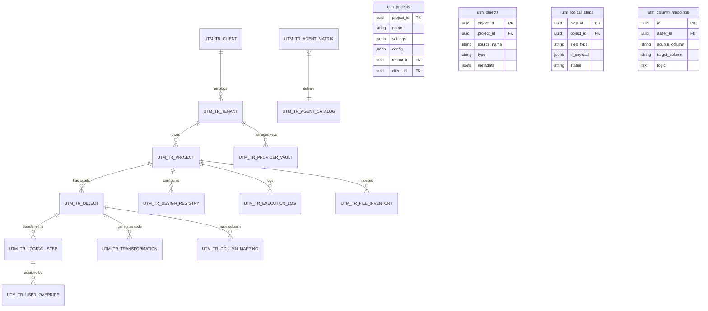

# Metadata Store: Data Model Specification (v3.8)

The **Metadata Store** is the central repository where the "intelligence" of Legacy2Lake resides. In v3.8, it adds **Process Locking** for data integrity, building on the Cloud-Native Storage (R2) and Isolated Multi-Tenancy introduced in v3.5.

## Recent Updates

### v3.8 (Process Locking & Governance):
- **`utm_process_locks`**: New table for concurrent execution prevention with smart timeouts
- **Lock Management**: Admin force-release capabilities and auto-expiration via RPC function
- **Governance Rules**: Formalized 3-layer ownership model (Admin/Tenant/User) documented
- **Reports Enhancement**: Version-agnostic templates and centralized Reports Library modal

### v3.5 (Cloud-Native & Multi-Tenant):
- **`tenant_id` Enforcement**: All project-related tables now transition to a mandatory `tenant_id` (UUID) for strict isolation via Supabase RLS.
- **R2 Storage Inventory**: The new `utm_file_inventory` table provides a metadata cache of objects stored in Cloudflare R2, enabling high-performance listing without constant S3-API calls.
- **Project Settings v2**: `utm_projects.settings` now includes environment variables, source/target tech, and tenant-specific configuration
- **Audit Persistence**: `utm_execution_logs` now stores structured phase-specific trace data (Phase 1-10).

---

## 1. Entity-Relationship Diagram (Logical Structure)

### 1.1 Project & Multi-Tenancy Core
*   **`utm_clients`**: Represents the customer organization.
*   **`utm_tenants`**: Individual users with RBAC roles (`ADMIN`, `USER`) linked to a client.
*   **`utm_projects`**: The central entity. Contains global `settings` (source/target tech) and `config` (variables).
    *   *Relations*: Belongs to a Tenant and Client. Parent of Objects, Logs, and Inventory.

### 1.2 Asset Management (`utm_objects`)
Represents artifacts (files) from the source system.
*   `metadata` (JSONB): Stores "Architect" inferences (Volume, PII, Complexity).
*   `type`: `LAYOUT` (Manifests), `DTSX` (SSIS), `SQL`, `NOTEBOOK`.

### 1.3 The Refinement Core (`utm_logical_steps`)
Stores the normalized Intermediate Representation (IR).
*   `ir_payload` (JSONB): The Universal Grammar JSON (Source -> Transformation -> Sink).
*   `status`: `DRAFT` -> `VALIDATED` -> `REFINED`.

### 1.4 Transformation & Code Gen
*   **`utm_transformations`**: Physical code generated from the Logical Steps.
*   **`utm_user_overrides`**: Stores human edits to the IR, ensuring reproducibility.
*   **`utm_column_mappings`**: Detailed field-level lineage and transformations.

### 1.5 Agent Orchestration
*   **`utm_agent_catalog`**: Registry of available agents (Name, Role).
*   **`utm_agent_matrix`**: Configuration linking Agents to specific LLM Models per Tenant/Project.
*   **`utm_provider_vault`**: Secure storage for LLM Provider API Keys (OpenAI, Azure) per Tenant.

---

## 2. Persistence & Consumption Logic

1. **Ingestion**: The **Parser Agent** populates `UTM_Object`.
2. **Forensics (Phase 5)**: **Architect v2.0** analyzes schema and populates `UTM_Object.metadata`.
3. **Normalization**: The **Kernel Agent** reads `UTM_Object`, processes logic, and generates multiple records in `UTM_Logical_Step`.
4. **Column Mapping (Phase 6)**: User defines transformations in `UTM_Column_Mapping`, including custom `logic` expressions.
5. **Change Management**: When a user edits a step in the UI, the system inserts a record into `UTM_User_Override` instead of overwriting the `ir_payload`.
6. **Code Generation (Phase 6)**: The **Output Cartridge** queries `UTM_Logical_Step`, applies any existing `UTM_User_Override`, and processes the Jinja2 template. Uses `metadata` for optimizations (partitioning, PII masking) and `variables` for parameterization.
7. **Governance (Phase 7)**: **Agent G** audits final code, generates certification report and runbook.
8. **Quality Contracts (Phase 9)**: **QualityService** reads `UTM_Column_Mapping` rules and generates validation suites.

---

## 3. Technical Considerations

- **Referential Integrity**: Maintaining Foreign Keys is vital for automatic column-level lineage.
- **Auditability**: `UTM_User_Override` is the most important table for Compliance, explaining why final code differs from legacy logic.
- **Scalability**: Using `JSONB` for payloads allows adding new operational types without altering physical table structures.
- **Metadata Evolution**: The `metadata` JSONB field in `UTM_Object` is version-safe—Architect v2.0 fields coexist with future enhancements.
- **Variable Injection**: Variables in `UTM_Project.settings.variables` are injected at code generation time, enabling environment-agnostic artifacts.
