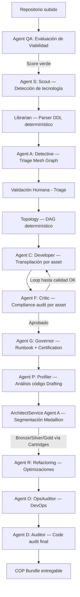

# Arquitectura de Agentes y System Prompts (v4.1)

El "cerebro" de la plataforma Legacy2Lake es una orquestación de **10 agentes especializados** en 2 categorías: 7 agentes LLM configurados por el tenant, y 3 motores determinísticos basados en reglas.

> **v4.1 Update (Mar 2026)**: Sistema auditado y completado — Agent B (Cartographer) eliminado por no tener implementación. Agent D corregido con su propio config en Agent Matrix. Agent QA incorporado al Intelligence Hub. Catálogo de agentes sincronizado con el código real.

---

## 1. Principio de Operación

**No existen LLMs "propios" de los agentes.** Todos los agentes LLM consumen el modelo configurado por el tenant en su Agent Matrix. El flujo de resolución es:

```
resolve_agent_model(agent_id)
    → utm_agent_matrix  (qué model_id asignó el tenant a ese agente)
    → utm_model_catalog (detalles técnicos del modelo)
    → utm_provider_vault (API key y URL del tenant, aislada por tenant_id)
    → { provider, deployment, endpoint, api_key, temperature }
```

Si un tenant no configura un agente, ese agente no opera — por seguridad no hay fallback hardcodeado.

---

## 2. Los 10 Agentes — Mapa Completo

### 2.1 Agentes LLM (7) — Configurados por tenant en Agent Matrix

| Agent ID | Nombre | Fase | Responsabilidad principal |
|---|---|---|---|
| **agent-qa** | Quick Assessor | Pre-Triage | Evaluación híbrida (determinística + LLM) de viabilidad del proyecto antes del Triage completo |
| **agent-s** | Scout | Pre-Triage | Análisis forense del repositorio para detectar tecnología origen, herramienta ETL, y gaps |
| **agent-a** | Detective | Triage + Refinement | Triage: construye Mesh Graph. Refinement: orquesta la segmentación Medallion vía ArchitectService |
| **agent-c** | Developer | Drafting | Transpila cada asset legacy al nuevo tech usando el cartucho activo |
| **agent-f** | Critic | Drafting | Audita el código de Agent C inmediatamente (mismo loop por asset), scoring 0-10 |
| **agent-g** | Governor | Drafting (final) | Genera Runbook y Certification Audit al final del pipeline |
| **agent-d** | Auditor | Refinement | Code audit post-refinamiento vía `AuditService` (usa prompt `agent_d_auditor`) |

### 2.2 Agentes Determinísticos (3) — Sin LLM, motores de reglas activos en Refinement

| Agent ID | Nombre | Fase | Qué hace |
|---|---|---|---|
| **agent-p** | Profiler | Refinement Phase 1 | `ProfilerService` — escanea archivos .py del Drafting, extrae metadata de tablas, PKs y conexiones |
| **agent-r** | Refactoring | Refinement Phase 3 | `RefactoringService` — aplica optimizaciones determinísticas de Spark/SQL y controles de seguridad |
| **agent-o** | OpsAuditor | Refinement Phase 4 | `OpsAuditorService` — valida readiness operacional y genera manifests DevOps |

---

## 3. El Pipeline Completo en Orden



### Componentes no-agente en el pipeline
- **Librarian** (`LibrarianService`) — Parser determinístico de DDL usando SQLGlot. Sin LLM.
- **Topology** (`TopologyService`) — Construye el DAG de ejecución. Sin LLM.
- **Los cartuchos** (`.md` en `utm_prompts`) — Son las reglas Medallion que `ArchitectService` aplica. No son agentes sino el "conocimiento" que el ArchitectService ejecuta.

---

## 4. Cartuchos — Las Reglas de Arquitectura

Los cartuchos son los archivos `.md` cargados en `utm_prompts` con `tech_stack` y `pattern_type` (bronze/silver/gold). **No son generados por LLM en runtime** — son las instrucciones pre-escritas que `ArchitectService` inyecta en el código al segmentar en capas Medallion.

`CartridgeFactory.get_cartridge(project_id, registry)` selecciona el cartucho correcto según el `target_tech` del proyecto.

**Cartuchos activos (10 tech stacks × 3 capas = 30 archivos):**

| Carpeta | Bronze | Silver | Gold | Tecnología |
|---|---|---|---|---|
| `pyspark/` | ✅ | ✅ | ✅ | PySpark / Delta Lake |
| `snowflake/` | ✅ | ✅ | ✅ | Snowpark Python |
| `snowflake_sql/` | ✅ | ✅ | ✅ | SQL nativo Snowflake |
| `sf/` | ✅ | ✅ | ✅ | Salesforce Data Cloud SQL |
| `aws/` | ✅ | ✅ | ✅ | AWS Glue PySpark |
| `dbt/` | ✅ | ✅ | ✅ | dbt SQL (Jinja) |
| `gcp/` | ✅ | ✅ | ✅ | BigQuery Standard SQL |
| `ms_fabric/` | ✅ | ✅ | ✅ | MS Fabric PySpark (Lakehouse) |
| `ms_fabric_sql/` | ✅ | ✅ | ✅ | MS Fabric Warehouse T-SQL (con limitaciones documentadas) |
| `base/` | ✅ | ✅ | ✅ | Genérico / Pseudocode |

---

## 5. Agent Matrix y Resolución de Modelos

**Tablas involucradas:**
- `utm_agent_catalog` — Catálogo maestro de los 10 agentes (definición)
- `utm_agent_matrix` — Asignación tenant → agent → model_id
- `utm_model_catalog` — Modelos disponibles con sus parámetros técnicos
- `utm_provider_vault` — API keys por tenant/proveedor (aisladas)

**Los 7 agentes LLM necesitan una entrada activa en `utm_agent_matrix` para operar:**

```sql
-- Ejemplo: Tenant asigna GPT-4o a Agent C (Developer)
INSERT INTO utm_agent_matrix (tenant_id, agent_id, model_id, is_active)
VALUES ('abc-123', 'agent-c', 'azure-gpt-4o', true);

-- Agent D (Auditor) tiene su propia entrada — no comparte config con Agent F
INSERT INTO utm_agent_matrix (tenant_id, agent_id, model_id, is_active)
VALUES ('abc-123', 'agent-d', 'azure-gpt-4o', true);
```

---

## 6. Prompts en Base de Datos

**Prompts de agentes en `utm_prompts`** (7 entradas activas):

| prompt_id | Usado por |
|---|---|
| `agent_qa_assessment` | Agent QA |
| `agent_s_scout` | Agent S |
| `agent_a_discovery` | Agent A |
| `agent_c_interpreter` | Agent C |
| `agent_f_critic` | Agent F |
| `agent_g_governance` | Agent G |
| `agent_d_auditor` | Agent D |

Los agentes determinísticos (P, R, O) no tienen prompts — operan con reglas hardcodeadas en Python.

---

## 7. Intelligence Hub

El **Intelligence Hub** (PromptsExplorer) muestra los agentes LLM activos por fase. El `STAGE_MAP` en `PromptsExplorer.tsx` refleja los 7 agentes:

| Vista | Agentes visibles |
|---|---|
| Triage | QA, S, A |
| Drafting | C, F, G |
| Refinement | D, G |
| All | QA, S, A, C, F, G, D |

---

**Document Version:** 3.0 (v4.1)  
**Last Updated:** Marzo 5, 2026  
**Cambios:** Auditoría completa de agentes — Agent B eliminado, Agent D corregido, Agent QA incorporado, cartuchos ms_fabric_sql agregados.

**See Also:**
- [DATABASE_SCHEMA.md](../DATABASE_SCHEMA.md)
- [SYSTEM_ARCHITECTURE.md](../SYSTEM_ARCHITECTURE.md)
- [ai_infrastructure.md](ai_infrastructure.md)
