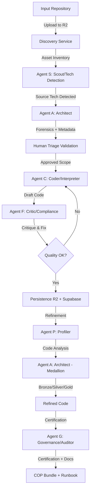

# Arquitectura de Agentes y System Prompts (v3.9 GA + v4.0)

El "cerebro" de la plataforma UTM (Legacy2Lake) no es un modelo monolítico, sino una orquestación de múltiples agentes especializados que colaboran para escanear, interpretar, auditor y documentar la migración.

> **v3.9 GA + v4.0 Update**: Sistema de **6 agentes especializados** con Agent Matrix multi-tenant. **v4.0 Zero-Hardcode**: Todos los prompts ahora se cargan desde la base de datos (`utm_prompts`) con versionamiento automático, eliminando templates hardcodeados del código.

Este documento detalla el rol de cada agente y expone sus **System Prompts reales**, revelando las reglas de comportamiento que gobiernan la IA.

## 1. El Ecosistema de Agentes (The Mesh)

La arquitectura sigue el patrón "Chain of Thought" y "Actor-Critic", donde un agente propone y otro valida.



---

## 1.5 v4.0 Zero-Hardcode Prompt System

**Nuevo en v4.0**: Todos los prompts del sistema ahora se almacenan en la base de datos (`utm_prompts`) con versionamiento automático. Esto permite:
- ✅ Actualizaciones instantáneas sin redeploy de código
- ✅ Versionamiento automático vía trigger PostgreSQL (`utm_prompts_history`)
- ✅ A/B testing entre versiones de prompts
- ✅ Rollback instantáneo en caso de regresión
- ✅ Prompts específicos por tenant o globales

**Migración:** Sprint v4.0 ejecutó `sprint_v4.0_prompts.sql` que cargó 14 prompts base desde archivos `.md` a la tabla `utm_prompts`.

### Carga de Prompts desde Base de Datos

Todos los agentes ahora cargan sus prompts dinámicamente:

```python
async def _load_prompt(self, prompt_id: str = "agent_c_coder") -> str:
    """Load prompt from database (global or tenant-specific)"""
    db = SupabasePersistence(tenant_id=self.tenant_id, client_id=self.client_id)
    return await db.get_prompt(prompt_id)
```

### Agent Matrix Multi-Tenant

**Nuevo en v3.9**: Cada tenant configura qué modelo LLM usa cada agente mediante la tabla `utm_agent_matrix`.

**Tablas del Sistema:**
- `utm_agent_matrix`: Mapeo agent_id → model_id por tenant
- `utm_model_catalog`: Modelos LLM habilitados por tenant (gpt-4o, claude-3.5, etc.)
- `utm_provider_vault`: API keys por tenant y proveedor (OpenAI, Azure, Anthropic, Groq)

**Ejemplo de Configuración:**
```sql
-- Tenant asigna GPT-4o a Agent C (Coder)
INSERT INTO utm_agent_matrix (tenant_id, agent_id, model_id, phase, is_active)
VALUES ('abc-123', 'agent-c', 'azure-gpt-4o', 'drafting', true);

-- Tenant asigna Claude 3.5 a Agent G (Governance)
INSERT INTO utm_agent_matrix (tenant_id, agent_id, model_id, phase, is_active)
VALUES ('abc-123', 'agent-g', 'claude-3-5-sonnet', 'certification', true);
```

**Resolución de Modelos:**
```python
async def _get_llm(self, project_id: Optional[str] = None):
    """Resolves LLM client strictly from Agent Matrix (DB)"""
    db = SupabasePersistence(tenant_id=self.tenant_id, client_id=self.client_id)
    config = await db.resolve_agent_model("agent-c")
    
    if config["provider"] == "azure":
        return AzureChatOpenAI(
            deployment_name=config["deployment_name"],
            api_key=config["api_key"],
            azure_endpoint=config["endpoint"]
        )
    # ... otros proveedores
```

---

## 1.6 Los 6 Agentes Especializados

El sistema cuenta con **6 agentes especializados**, cada uno con responsabilidades específicas en el pipeline de migración:

| Agent ID | Nombre | Fase | Responsabilidad |
|----------|--------|------|-----------------|
| **agent-s** | Scout | Discovery | Detección de tecnología origen |
| **agent-a** | Architect | Triage & Refinement | Análisis forense + diseño Medallion |
| **agent-c** | Coder | Drafting | Generación de código con cartridges |
| **agent-f** | Critic | Drafting | Validación y scoring de calidad (0-10) |
| **agent-p** | Profiler | Refinement | Análisis de código generado |
| **agent-g** | Governance | Certification | Auditoría de compliance + Runbook |

### Knowledge Injection Pattern
Cuando se detecta una tecnología (ej: "SQLSERVER"), el sistema:
1. Carga el prompt correspondiente desde `utm_prompts`
2. Extrae `tech_stack` y `pattern_type` para el cartridge
3. Inyecta esta instrucción en el contexto de todos los agentes
4. Configura el cartridge correspondiente para generación

### Versionamiento Automático
- Cada cambio a un prompt crea una entrada en `utm_prompts_history`
- Trigger PostgreSQL automático `trg_utm_prompts_version`
- Rollback disponible mediante query a tabla de historial
- UI de Prompt Lab permite ver versiones anteriores

### Contract Enforcement
Cada agente retorna JSON estructurado según su contrato:
- **Agent S**: `{"detected_source": "...", "confidence": 95}`
- **Agent A**: `{"nodes": [...], "edges": [...]}`
- **Agent C**: `{"code": "...", "tests": "..."}`
- **Agent F**: `{"score": 9, "status": "APPROVED", "feedback": "..."}`
- **Agent G**: `{"score": 91, "checks": [...], "runbook_markdown": "..."}`

---

## 2. Detalle de Agentes y Prompts

### Agent S: El Scout (Technology Detection) → **NEW IN v3.5**
**Misión:** Detectar automáticamente la tecnología origen durante el Triage analizando extensiones de archivo, sintaxis SQL, y patrones de código.

**System Prompt Actual (`agent_s_scout.md`):**
> "You are a Technology Scout specialized in identifying source platforms... Analyze file patterns, SQL dialects, and ETL tool signatures."

**Capacidades:**
1. **File Extension Analysis**: `.dtsx` → SSIS, `.dsx` → DataStage, `.sql` → SQL dialect detection
2. **SQL Dialect Detection**: Distingue T-SQL vs PL/SQL vs MySQL basándose en sintaxis específica
3. **ETL Tool Fingerprinting**: Identifica patrones de Informatica, Talend, Pentaho en archivos XML/JSON
4. **Version Detection**: Extrae información de versión de metadatos de herramientas
5. **Confidence Scoring**: Retorna un score de confianza (0-100) sobre la detección

**Output JSON**:
```json
{
  "detected_source": "SQLSERVER",
  "confidence": 95,
  "version_hint": "2019",
  "dialect": "T-SQL",
  "evidence": [
    "Found .sql files with T-SQL specific syntax (TRY/CATCH, EXEC sp_)",
    "Detected SSIS .dtsx packages"
  ],
  "suggested_target": "DATABRICKS"
}
```

**Reglas Clave:**
1. **Multi-Signal Analysis**: Combina múltiples señales (extensiones, sintaxis, metadata) para alta precisión
2. **Fallback Strategy**: Si no puede detectar con certeza, solicita confirmación manual al usuario
3. **Knowledge Injection**: Una vez detectado, activa la carga del prompt correspondiente de `origins/{tech}/`

---

### Agent A: El Arquitecto (Architect Service) → **DUAL-PHASE EXECUTION**
**Misión:** Análisis forense durante TRIAGE y diseño de arquitectura Medallion durante REFINEMENT.

**Prompts en DB (v4.0):**
- `agent_a_architect`: Prompt base para análisis de arquitectura
- Carga dinámica desde `utm_prompts` table

**Fases de Ejecución:**

**Fase 1 - TRIAGE (Discovery):**
1. **Inferencia de Volumen:** Estima `LOW | MED | HIGH` basándose en row count del esquema fuente
2. **Detección de PII:** Analiza nombres de columnas (`email`, `ssn`, `phone`) y marca `is_pii = true`
3. **Sugerencia de Particionamiento:** Si detecta columnas DATE con alta cardinalidad, sugiere `partition_key`
4. **Clasificación Funcional:** Separa `CORE` (lógica migratable) de `SUPPORT` (configs) y `IGNORED` (basura)

**Fase 2 - REFINEMENT (Medallion Design):**
1. **Bronze Layer:** Genera código de ingestion directa desde source
2. **Silver Layer:** Aplica limpieza, estandarización, deduplicación
3. **Gold Layer:** Crea agregaciones y lógica de negocio
4. **Infrastructure:** Genera `config.py`, `utils.py`, `orchestration_dag.py`

**Reglas Clave:**
1. **Inferencia de Negocio:** Deduce entidades del mundo real (ej. `DimCustomer.dtsx` → Entity: `CUSTOMER`)
2. **Detección de Orquestación:** Busca llamadas explícitas (`Execute Package`) para crear dependencias
3. **Medallion Architecture:** Organiza código en capas Bronze → Silver → Gold
4. **Cartridge Integration:** Usa `CartridgeFactory` para obtener templates específicos por tech_stack

---

### Agent C: El Programador (Coder Service) → **CONTEXT-AWARE GENERATION**
**Misión:** Traducir la *intención de negocio* a código moderno usando cartridges. Fase principal: DRAFTING.

**Prompts en DB (v4.0):**
- `agent_c_coder`: Prompt base para generación de código
- Cartridges cargados desde `utm_prompts` filtrados por `tech_stack` y `pattern_type`

**Nuevas Capacidades (v4.0):**
1. **Zero-Hardcode Templates:** Todos los cartridges ahora desde DB (no archivos .md)
2. **Real-Time Validation:** Integración con `ValidationService` para corrección automática (hasta 3 intentos)
3. **Inyección de Particionamiento:** Si `metadata.partition_key` existe, genera `.partitionBy(col)`
4. **Masking Automático de PII:** Si `metadata.is_pii = true`, genera `sha2(col("email"), 256)`
5. **Optimización por Volumen:** Si `metadata.volume = HIGH`, prioriza shuffles eficientes

**Reglas Clave:**
1. **Idempotencia Obligatoria:** Genera lógica `MERGE INTO` con claves de negocio (no `mode("overwrite")`)
2. **Integridad Referencial:** Inyecta manejo de "Miembros Desconocidos" (`COALESCE(col, -1)`) en Lookups
3. **Arquitectura Medallion:** Organiza código en celdas: `Config` → `Extract` → `Transform` → `Load`
4. **Surgical Logic:** Extrae solo la "médula lógica" (queries y transformaciones), ignora ruido XML

**Code Example (v4.0):**
```python
async def transpile_task(self, node_data: Dict[str, Any]) -> Dict[str, Any]:
    # Load prompt from database (v4.0)
    prompt = await self._load_prompt("agent_c_coder")
    
    # Get cartridge rules from database
    cartridge = CartridgeFactory.get_cartridge(
        project_id=self.project_id,
        registry=node_data,
        tenant_id=self.tenant_id
    )
    
    # Generate code with real-time validation
    code = await self._generate_code(prompt, cartridge, node_data)
    validated_code = await self.validator.validate_and_fix(code)
    
    return {"code": validated_code, "status": "generated"}
```

---

### Agent F: El Auditor (Critic Service) → **DYNAMIC COMPLIANCE**
**Misión:** Garantizar calidad del código antes de persistir. Sistema de scoring 0-10 con estados APPROVED/IMPROVED/REJECTED.

**Prompts en DB (v4.0):**
- `agent_f_critic`: Prompt base para code review
- Reglas de compliance desde cartridges (mismo source que Agent C)

**Capacidades (v3.9 + v4.0):**
1. **Scoring System (0-10):**
   - 0-4: `REJECTED` (regenerar código completo)
   - 5-7: `NEEDS_WORK` (requiere ajustes menores)
   - 8-9: `IMPROVED` (aprobado con sugerencias)
   - 10: `APPROVED` (perfecto, sin cambios)

2. **Dynamic Rule Enforcement:** Obtiene reglas del mismo cartridge que usó Agent C
3. **Technology-Specific Critiques:** Aplica reglas específicas para PySpark, Snowflake, DBT, etc.
4. **Feedback Estructurado:** Retorna JSON con score, status, y feedback detallado

**Reglas Clave (Checklist Estricto):**
1. **Reject Hardcoding:** Si detecta credentials o rutas absolutas → `REJECTED`
2. **Precision Casting:** Verifica que `cast()` coincidan exactamente con DDL de destino
3. **Merge Validation:** Si es carga Delta y falta `MERGE`, marca como `REJECTED`
4. **Cartridge Compliance:** Valida contra las mismas reglas que generaron el código

**Output JSON:**
```json
{
  "score": 9,
  "status": "IMPROVED",
  "feedback": "Excellent implementation. Consider adding error handling for null foreign keys.",
  "issues": ["Minor: Missing error logging in exception handler"]
}
```

---

### Agent P: El Perfilador (Profiler Service) → **CODE ANALYSIS**
**Misión:** Analizar código generado durante REFINEMENT para extraer metadata y patrones. Primera fase de REFINEMENT.

**Prompts en DB (v4.0):**
- Análisis automático vía AST parsing (no usa LLM directamente)
- Metadata extraction para Agent A

**Capacidades:**
1. **File Analysis:** Escanea archivos .py generados en DRAFTING
2. **Table Metadata:** Extrae nombres de tablas, schema, conexiones
3. **Connection Detection:** Identifica conexiones compartidas entre archivos
4. **Primary Key Detection:** Analiza lógica de negocio para identificar claves

**Output:**
```python
{
  "analyzed_files": 7,
  "shared_connections": ["sqlserver_conn", "databricks_conn"],
  "table_metadata": {
    "DimCustomer": {
      "source_table": "dbo.Customers",
      "target_table": "dim_customer",
      "primary_key": "customer_key"
    }
  },
  "total_files": 7
}
```

**Uso en Pipeline:**
1. Agent P analiza archivos en `/drafting`
2. Genera `profile_metadata.json`
3. Agent A consume este metadata para diseñar Medallion architecture

---

### Agent G: Gobernanza (Governance Service) → **AI-DRIVEN CERTIFICATION**
**Misión:** Auditoría de compliance y generación de documentación técnica (Runbook). Fase: CERTIFICATION.

**Prompts en DB (v4.0):**
- `agent_g_governance`: Prompt principal para auditoría
- Carga dinámica desde `utm_prompts` (1568 chars en logs actuales)

**Capacidades (v3.9 + v4.0):**
1. **Compliance Audit (Score 0-100):**
   - **PII Masking:** Verifica que campos sensibles estén enmascarados
   - **Source-to-Target Lineage:** Valida trazabilidad completa
   - **Partition Strategy:** Evalúa optimizaciones de performance
   - **Error Handling:** Verifica manejo de errores robusto
   - **Data Quality:** Checks de validación y constraints
   - **SCD Handling:** Slowly Changing Dimensions implementados correctamente
   - **Documentation:** Runbook y documentación técnica

2. **Runbook Generation:** Genera `Modernization_Runbook.md` en formato markdown
3. **Audit JSON:** Retorna estructura con checks individuales y recomendaciones
4. **Export Bundle:** Crea ZIP con código + runbook + manifests

**Output JSON (Ejemplo Real - Feb 16, 2026):**
```json
{
  "score": 91,
  "checks": [
    {"check_name": "PII Masking", "status": "PASSED", "detail": "..."},
    {"check_name": "Source-to-Target Lineage", "status": "PASSED", "detail": "..."},
    {"check_name": "Partition/Optimization Strategy", "status": "WARNING", "detail": "..."},
    {"check_name": "Error Handling", "status": "PASSED", "detail": "..."},
    {"check_name": "Data Quality Constraints", "status": "WARNING", "detail": "..."},
    {"check_name": "SCD Handling", "status": "PASSED", "detail": "..."},
    {"check_name": "Runbook/Documentation", "status": "PASSED", "detail": "..."}
  ],
  "recommendations": [
    "Implement partitioning on large fact tables",
    "Add explicit data quality checks in ETL pipelines"
  ]
}
```

**Scoring Thresholds:**
- **91-100:** Excellent (Production Ready)
- **70-90:** Good (Minor improvements recommended)
- **50-69:** Fair (Requires attention)
- **0-49:** Poor (Major issues, not ready)

---

## 3. Conclusión: El "Cerebro" Multi-Agente de Legacy2Lake

Lo que diferencia a UTM de un simple "convertidor de sintaxis" es esta estructura de roles especializada:

1. **Detección:** Agent S identifica tecnología origen automáticamente
2. **Contexto:** Agent A entiende el "Todo" antes de tocar una línea de código (forensics + Medallion)
3. **Generación:** Agent C traduce intención de negocio a código moderno con cartridges
4. **Calidad:** Agent F garantiza que no se propague deuda técnica al nuevo sistema
5. **Refinamiento:** Agent P + Agent A crean arquitectura Bronze/Silver/Gold optimizada
6. **Governance:** Agent G certifica compliance y genera documentación completa

**v4.0 Zero-Hardcode:** Todos los prompts desde base de datos con versionamiento automático, permitiendo mejora continua sin deployments.

*Nota: Los prompts completos están disponibles en la tabla `utm_prompts` de la base de datos.*

---

**Document Version:** 2.0 (v4.0)  
**Last Updated:** Febrero 17, 2026  
**Sprint:** Sprint 14 Phase 2  
**Status:** Zero-Hardcode Prompts 100% Complete  

**See Also**:
- [DATABASE_SCHEMA.md](../DATABASE_SCHEMA.md) - utm_prompts table schema
- [SYSTEM_ARCHITECTURE.md](../SYSTEM_ARCHITECTURE.md) - Zero-Hardcode architecture
- [ai_infrastructure.md](ai_infrastructure.md) - Multi-LLM strategy
- [V4.0_DEVELOPER_GUIDE.md](../../V4.0_DEVELOPER_GUIDE.md) - PromptService patterns

---
